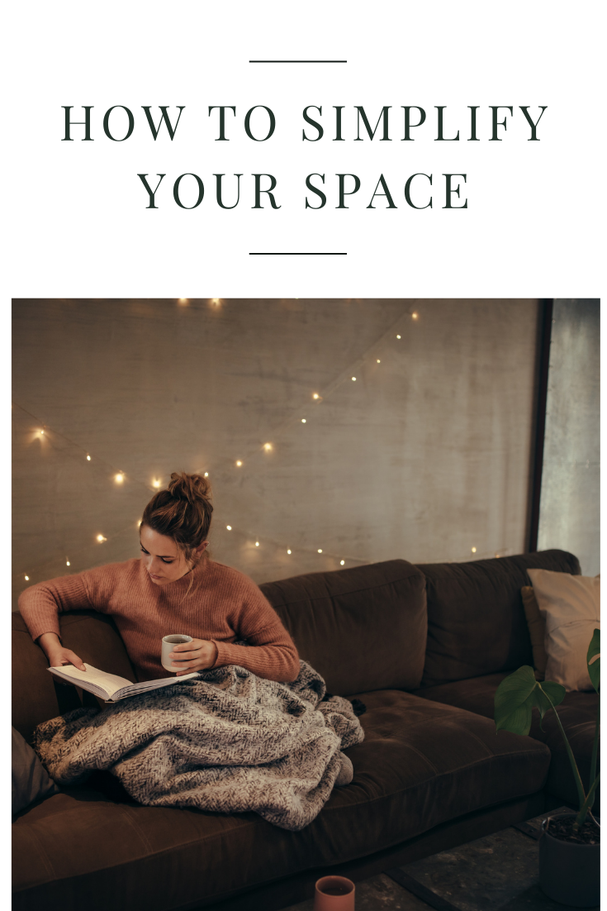

Your physical living space should make you feel calm, productive, and happy. If you’re surrounded by clutter and things that you resent, your stress will grow with the piles. Simplifying your space can help you reduce the clutter and make things easier to clean, find and use.

### 01\. SIMPLIFYING IS NOT ORGANIZING

**_Organizing_** _— to arrange, to sort, to order  
_**_Simplifying_** _— to make easy, to remove complexity from_

Organizing is a quick way to clean up a space and tidy things up, but the problem is when **organizing can’t last long term**. Simplifying is putting a new system in place and getting rid of things that make a task hard. For example, you could organize your pantry in alphabetical order but practically, when it came time to bake cookies, grabbing all the supplies you need would take forever. You could organize categorically, but if you have 4 different containers of sugar, two flours (one of them expired but you don’t know which) and you’re out of butter, cookies won’t be easy.

Simplifying is different than organizing because **it’s about addressing the problem and coming up with a solution that will work long term**. You can look up organization tips on Pinterest and buy different containers for everything, but until you pull everything out of a space and figure out how to make it work, organizing will never last.

It is important to note, that **there is a time and place for organization**. Once your pantry has been cleaned out and you have all your ingredients in a system that makes sense, using organizational tools can help you to make a space prettier or give yourself better storage solutions.

### 02\. EASING INTO SIMPLIFYING

You don’t need to pull out everything in your home and _“Marie Kondo”_ the crap out of your house. **Start with the space that you use the most**. Start with your bathroom drawers, your fridge, or your clothes. Start somewhere you touch every day and work towards the bigger messes as you go.

If you want some specific step-by-step instructions to decluttering and living with less stuff, check out the [30 Day Simplify Challenge](https://shop.noraconrad.com/30-day-simplify-challenge). If you want some general tips, here are some ways to get started:

- Donate/Toss/ Recycle the things you have duplicates of. Do you need 24 coffee mugs? Do you want to keep all 13 of your plain white t-shirts?
- When you can, remove labels and extra branding. You’d be surprised how much removing extra “text” from a space can make it feel less overwhelming. I try to buy dried goods in bulk so I use jars and clear canisters when possible and practical.
- Unsubscribe from newsletters, magazines, commercials, ads, and mailers that tempt you to purchase things. I don’t follow a single company on my Instagram or Facebook account because one little 10% coupon had me running to purchase something I didn’t need. When I do need something, I’ll research a product, look for sales and buy only what I need.
- Find alternative storage when your space isn’t working for you. Deep cabinets might benefit from pull-out drawers or lazy-susans. An unused coat closet can be an overflow pantry, linen closet, etc. A blank wall with some extra shelving can add a ton of vertical storage. Look around your home and see if your space can work better.
- Buy groceries online. Grocery stores are designed to get you to buy more. Avoid the temptation altogether and go in with a pre-planned list of what you need, or better yet, grocery shop online for free pickup or grocery delivery. You’ll buy only what you need and you can easily compare prices instead of always reaching for the brand name you recognize.
- Purchase frequently used items in bulk and unique items in pre-portioned sizes. For example, buy a 25 lb bag of rice if you’ll eat in within 6 months, but when you need sesame seeds for a recipe, buy a tiny bag from a farmers market so you don’t have “leftovers” in your pantry for 4 years. The same goes for shampoo, makeup, linens, and socks.
- When possible, invest in multi-use items to cut down on how many tools you need. A reusable silicone bag can be a zip lock for leftovers, a sousvide bag, and a snack pack for the kids. An all-purpose cleaner can replace the 8 various cleaners specific to one area in your home.
- If you haven’t used it in the last year, let it go. Humans are hoarders, we like to hold onto things “just in case”. You can always borrow, purchase, rent or find an alternative to what you got rid of.

### 03\. YOU NEED LESS THAN YOU THINK

We live in a consumer-driven society. We’re always looking for a fix to a problem, and often we get tricked into buying something that we don’t need in order to fix a problem that wouldn’t exist if we would just stop buying things. We buy organizational tools to house the mountains of crap we’ll never use. We buy 19 different cleaners to clean the crap we rarely touch. And we buy and collect items to mentally “refresh” or “treat ourselves”.

I’ve learned some really interesting lessons over the last couple of years of intentional simplicity. (No, I’m not a minimalist).

1. My 6-year fight against acne and breakouts suddenly ended when I stopped wearing makeup, stopped washing my face (gasp), and started eating better. Turns out more products were never the solution. I’m at the point where I don’t even use face lotion. I have some sunscreen I use when I’m outside and some witch hazel to wipe off dirt and sweat after a workout or swim, but that’s it.
2. I lost the baby weight, maintained plenty of breastmilk, and felt awake each morning by eating my fruits, veggies, protein, and carbs every day and drinking a crap-ton of water throughout the day. No protein shakes, vitamins, oils, or special cookies are required.
3. My clothes and shoes look nicer and last longer now that I’ve gotten rid of all the stuff I never wore and I paid more for sustainably-sourced, well-made pieces that I wear every single week. I also find myself doing less laundry because the clothes stay cleaner and I take better care of them. (P.S. this took a few years to build up but it’s been SO worth the process — [this is a really great article if you’re interested in doing something similar](https://buymeonce.com/blogs/articles-tips/sustainable-wardrobe-part-one-building-a-capsule))

I find myself spending less time at the mall and more time at the park. I spend less money going out to eat and more time cooking meals and learning how to cook new things (turns out I LOVE to cook). I spend less energy cleaning and maintaining crap I didn’t even like and I have more energy to play with my daughter and volunteer at church.

The more clutter and unnecessary things I’ve cut out of my life, the happier my days have been. That sounds cliche and over-simplified but it’s not. Try it and let me know if you disagree.

### 04\. PRETTY KITCHENS ARE ATTAINABLE (AND PRETTY HOMES)

I feel like 90% of the time when you think about simplifying your space, you think about your closet or your kitchen pantry. That’s usually because those are the daily spots that cause overwhelm. We look on Pinterest for ideas and we’re bombarded with walk-in style pantries, room-sized closets, and custom built-ins worthy of a magazine. What happens if you live in a small apartment with no pantry space or if your closet barely hangs 20 pieces?

Pretty homes are not out of reach just because “you don’t have room”. You need to make your space work for you. If you don’t have room to own 40 dressed and 22 pairs of shoes, you need to get rid of some of them. If you don’t have the pantry big enough to fit Costco-sized portions in there, you need to find other methods to save on groceries.

When we moved into our new apartment, we went from having two large pantries to one super deep, super-narrow pantry. It’s been a mess for about a month, so I wanted to tackle the space on the video to give you some ideas and inspiration for how easy it can be to take a not-so-ideal space and make it work for you.

![[https://youtu.be/7FNNSa-gfAg]]

Products shown in the video are listed below as affiliate links. Please remember to check what you already have and can re-purpose before purchasing new. All of the products you see me use are things we already owned and were not using or things we were able to find at thrift shops and garage sales for cheap.

- [Mason Jars](https://amzn.to/2ZmLANf)
- [Plastic pop-top canisters](https://amzn.to/2HqkK0r)
- [Lazy Susan (similar)](https://amzn.to/2Zh9rTn)
- [Spice Racks and metal shelves (similar)](https://amzn.to/2KUpAFh)
- [Storage bins (similar)](https://amzn.to/2ZuqpZn)
- [Metal storage canisters](https://amzn.to/3222KRL)

* * *

