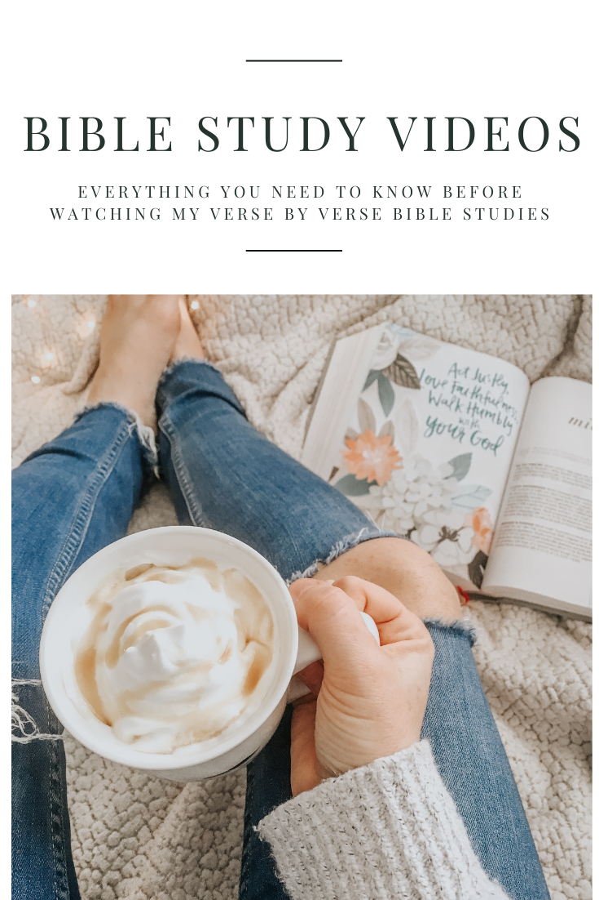

I’ve been doing Bible studies and talking about being a Christian on my blog and on YouTube for a while now. I’m finally getting around to rounding up what tools I use to create my Bible studies and I need to clear up a few topics that have been addressed repeatedly on my videos. Let’s jump right in.

### 01 A NECESSARY DISCLAIMER

I am not a theologist, I am not a pastor, I did not go to bible college, I have no formal training in this topic — but I truly believe God has called me to share my understanding. I believe it is ok for me to teach what I do know and say “I’m not sure” to the things I don’t yet understand. I believe God calls all of us to share our faith and that you don’t need to be a Bible scholar to do so.

My Youtube channel and my blog are meant to entertain you and hopefully inspire you to dig into God’s word. The rest is on you. If you disagree with me on the translation I use, read a different translation. If you don’t think I explained a passage well, do your own research. If you disagree with the theology of something I said, do your own reading.

**I am not your holy spirit and I don’t intend to be.**

I pray that every word I say in these videos and in these posts is what God intends for me to share and anything that is not correct will fall to the side. I make these videos to glorify God, not myself. I will not debate and argue in the comments, I will turn comments off when necessary. I hope that if I misspeak, misquote, or mispronounce something, someone can correct me in a polite manner.

I made the decision to turn off comments on my Christian-related YouTube videos because of the amount of spam, questions, and ignorant comments I received. I didn’t have time to filter through all of them and I found them to be incredibly distracting for viewers. When someone watches my videos, I would hope that they would focus on the content rather than comments. I also hope that by posting this blog post, you can ask your questions here after getting a better understanding of who I am and why I make this content (also the extra clicking through usually discourages spam, sorry for the inconvenience).

### 02 CHOOSING A BIBLE

In all of my Bible study videos, I recommend that before watching my breakdown, you read _three_ different versions of the passage we’re studying. I read from the following; ESV or NIV (my journaling Bibles), NKJV (my study Bible), and my CSB (my She Reads Truth Bible). The reason I recommend doing this is to give you the most accurate picture of what the passage is saying.

Different translations of the Bible translate based on a spectrum ranging from word-for-word, thought-for-thought, and paraphrasing translations. For example, if you want a word-for-word translation, you might grab an ESV or KJV bible. If you wanted a Bible that is a thought-for-thought translation, you might read the NLT or for a paraphrased version, The Message Bible. I tend to prefer more of a word-for-word translation but the CSB is smack in the middle of the spectrum along with NIV, which is a very popular translation.

If you want a SUPER literal word-for-word translation, [The Interlinear Hebrew and Greek Bible](https://www.christianbook.com/interlinear-hebrew-greek-english-bible-volumes/9781565639805/pd/639804?event=ESRCN%7CM) are what you need. If you’re buying a Bible for a 10-year-old, [The Adventure Bible](https://www.christianbook.com/niv-adventure-bible-hardcover-jacketed/9780310727477/pd/727471?event=Bibles%7C1006341) might be a better fit. If you want to learn more about different translations, check out [this page](https://www.christianbook.com/page/bibles/about-bibles/about-translations). Different reading levels are important to keep in mind as well. Especially if English is your second language or if you’re brand new to the Bible. You can learn more about reading levels [here](https://www.christianbook.com/page/bibles/about-bibles/bible-translation-reading-levels?event=Bibles%7C1002945).

At the end of the day, what’s important is that you use whatever version you understand best and what will keep you reading and learning. There is always time to expand into different translations over time. Bible translations are a sensitive subject for some people, as I’ve learned through my YouTube comment section. However, I think there is something even more important than what version you use; context.

### 03 UNDERSTANDING CONTEXT

The Bible may be the most misquoted and improperly used book in all of history. We throw down verses that seem like they fit a situation and hope that it makes sense in today’s world. This is why the Bible is so often used as a weapon instead of a message of hope. Understanding the context of whatever passage you’re reading may be the best way to begin to dig deeper into your Bible and apply the things you learn to your life.

Let’s start with an example. In Leviticus 19:19, it states, “\[do not\] put on a garment made of two kinds of material”. So, your shirts can’t be made of both linen and wool? There are many laws in Deuteronomy and Leviticus that seem ridiculous and even laughable, but when you look into the context, you can understand _why_ they were law. The Jewish people were meant to stand out against the common culture of their times. Specific religious practices like human sacrifice, cutting scars into your skin for the dead, mixing fabrics for offerings, and worshiping specific Pagan gods were all outlawed for the Israelites.

There is a [really interesting Podcast](https://thebibleproject.com/podcast/science-faith/) by one of The Bible Project creators, Tim Mackie, talking about the cultural context in the Bible that is FANTASTIC for understanding the Bible on a deeper level. I highly recommend listening to it if this is something you’re interested in better understanding.

Once you appreciate the importance of context, you need to find the tools and resources that can help you understand the context of any of the passages you want to study. No one will expect you to fully understand what it was like to live in Israel 2,000 years ago, but luckily scholars have done most of the work for us. Using the proper resources can give you a glimpse into this time period and give you new insights into a passage.

### 04 RESOURCES

Before I give you a list of resources I use, it’s important to understand the various types of resources you can use while reading the Bible. Let’s just focus on five of the popular ones.

#### COMMENTARIES

Bible commentaries are studies written by various authors about a passage or entire chapters of the Bible. There are hundreds of thousands of commentaries that you can read. One of my favorite tools for finding good commentaries is the [Logos app](https://www.logos.com/partner/nora?utm_source=nora&utm_medium=partner&utm_campaign=promo-partner). I use the paid version but there’s a free version as well that is fantastic for Bible studies. You can easily google commentaries on specific verses as well. Be careful not to rely on these too heavily, remember that the actual Bible should always be your first resource.

#### DICTIONARIES

Bible study tools have various [Bible Dictionaries](https://www.biblestudytools.com/dictionaries/) you can use online. The idea here is that you can research a name, word, phrase, or passage and get a better understanding. Phrases like false prophet, grace, or faithfulness can be researched and used to better understand the passage you’re studying. This is really helpful if you are new to the Bible and you’re having trouble understanding “Christianese”. Another great resource for questions you might have about Biblical topics is [Got Questions](https://www.gotquestions.org/).

#### TRANSLATIONS

Reading a passage in various translations can be really helpful for getting a better picture of the story. You can use a translation like [THIS ONE](https://biblehub.com/interlinear/) that will help you find and define the original Greek or Hebrew words used in a passage. As I said before, reading in more than one translation can be a simple way to better understand the text. Using a free app like the Bible app can make switching between different versions quick and easy.

#### CROSS-REFERENCES

Many bibles include cross-references in the notes of a passage, but you can easily use Logos, Bible.com, or similar apps to view even more. A cross-reference will show you where similar ideas, people, or direct quotes were taken from other pieces of the Bible. These can be really helpful to tie together stories that are told in both the new and old testaments.

#### BACKGROUNDS

In some Bibles, such as the She Reads Truth Bible, each chapter begins with a background commentary. This is where you get an idea of the time, place, author, and other important notes to the book. Be sure to pay attention to what is factual evidence and what is speculation. For example, many of the Authors of the Bible are unknown but different sources will make their best guesses. You can easily google the historical background of various books as well.

Using a combination of various sources, translations and contexts can really open up your eyes to the broader view of the Bible as one cohesive story. I like to use a few different resources when studying and when creating my study videos:

1. [Logos](https://www.logos.com/partner/nora?utm_source=nora&utm_medium=partner&utm_campaign=promo-partner) — a bible app and web platform used to view different resources side-by-side.
2. [Bible](https://www.bible.com/) — this app and website put various translations, reading plans and community at your fingertips.
3. [The Bible Project](https://thebibleproject.com/) — they have hundreds of free videos breaking down ideas, chapters, and topics of the Bible. They are incredibly well done. They also have podcasts and study guides you can use for free.
4. [She Reads Truth Bible](https://amzn.to/2nAPCEN) — SRT is a Bible study maker that released their CSB Bible a few years ago. I use it as my daily read Bible.
5. [Journaling Bible](https://amzn.to/2nzYOsU) — this is the one you’ve seen in my old videos. I still use it regularly but I do now use [THIS](https://amzn.to/2p9YEcn) one in my videos since the old one is so full that it can be hard to read in videos.
6. [NKJV Study Bible](https://amzn.to/2nD6oTB) — I’ve had this guy since middle school and it’s such a helpful reference for my daily reading. You can easily find a version like this online but I do love having a physical book as well.

I also get asked a lot about the pens, materials, and books I use for my videos. You can always find those in the video descriptions, but you can also find an updated list [here](https://www.amazon.com/shop/noraconrad?listId=1RT9GV35LZA5B&ref=idea_share_inf).

### 05 FINAL NOTES

I want to make sure that you understand **all of these translations and resources can be found for free**. I enjoy having a little collection of Bibles at home, but it is completely unnecessary to spend money in order to study the Bible. Even one free app like the Bible app is enough to get you started. _Please do not be overwhelmed by the number of resources or information that I just threw at you_. Studying your Bible can be (and is meant to be) a life-long venture. You do not need to be an expert or get a degree to start.

I hope that this post answered some of the questions you might have about starting your own Bible study or maybe it cleared up something I said in an old video. To watch my Bible study videos head over to my [Study Playlist](https://www.youtube.com/playlist?list=PLnUnQIJrz3cqqUrwE4vA-X3otF4joOugu) and pick a place to start.

#### WHAT APPS, BOOKS, TRANSLATIONS OR WEBSITES DO YOU LOVE AND RECOMMEND FOR BIBLE STUDIES AND RESOURCES? SHARE THEM BELOW AND LET ME KNOW IF YOU HAVE ANY QUESTIONS.

* * *

