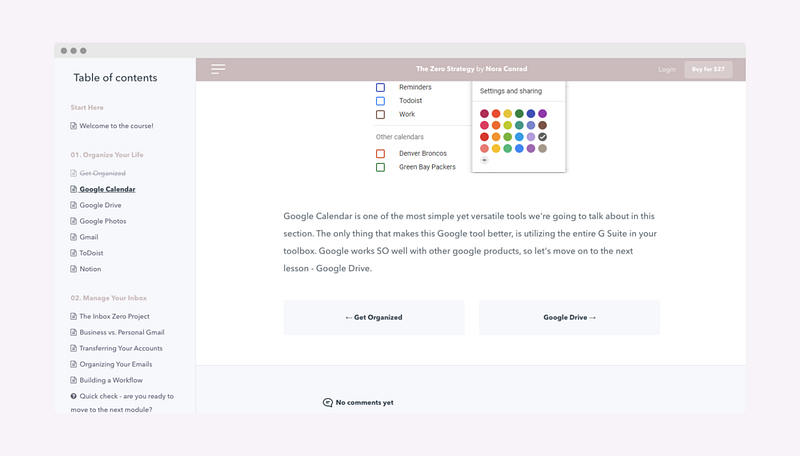
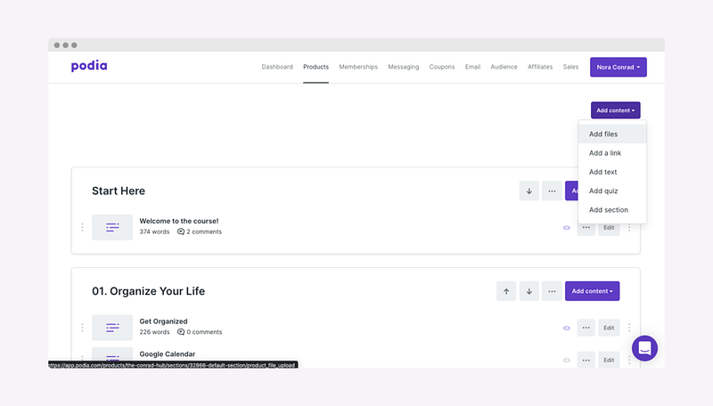
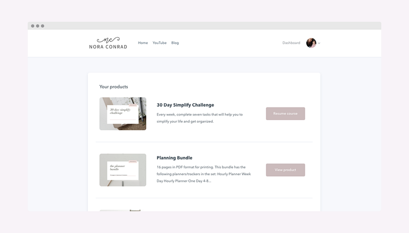

My business has been mostly on auto-drive during the last few months. I’ve spent a lot of years building up my business and I feel like I have a pretty good grip on what has worked well when it comes to passive income. My biggest sources of passive income have been YouTube Adsense, Affiliate Links, and my Podia courses — today we’re going to focus on Podia.

_fyi — this post is_ **_NOT_** _sponsored_

### AFFILIATE INCOME

In the spirit of total transparency, I have to start with the fact that Podia actually happens to be the affiliate I make the most income from as well as where I host my courses. When users sign up with [my link](https://podia.sjv.io/nora), I get a 30% commission on their sale — whether that’s a monthly subscription or yearly — that’s a generous program.

High commission paired with a couple of popular YouTube videos and my affiliate income from the program is fairly substantial in the scope of my business.

From top to bottom, Podia does a dang good job making their customers and partners happy. From quick email responses to a personal feel in their newsletters and webinars, you can just tell the people behind the keyboards are genuinely nice folks.

While the commission is a huge bonus and allows me to make some passive income, I would recommend Podia whether I made money off it or not. Between the user interface and the features, it’s well worth the investment and even convinced me to move my courses and products off my own website. So, let’s dive into some of that.

_(p.s. obviously, this post is going to have my affiliate links, you do not have to use them but if you do end up on Podia, thank you for your support)_

### COURSES HOSTED ON SQUARESPACE

When I wanted to create a membership website, I started looking for the best apps and tools to host it on my own Squarespace site. I liked the idea of my audience never leaving my site to access the content and I wanted full control over the design elements. This was a great idea in theory, but after using three different tools, spending weeks tweaking with the design, and countless customer service emails — I realized hosting a course or membership site externally was not only cheaper but much simpler.

Since my initial try at hosting an online membership, I’ve switched to using Podia to host everything. I still recommend [Memberspace](https://www.memberspace.com/) to anyone who wants to host their content with Squarespace, but if you’re open to the idea of [Podia](https://podia.sjv.io/nora), keep reading.

### COURSES CAN FEEL DAUNTING

If you’ve never made a course before, Podia helps it feel less daunting. The editor is unlike any other course host I’ve used (and I’ve tried a pretty hefty amount of hosts). The approach feels like writing a series of blog posts — something that can feel much more attainable than writing an entire course in one go.

The text editor uses super basic [rich-text editing](https://podia.sjv.io/P0q4jX), which can feel limiting at first if you’re used to platforms with HTML editors, but for first-timers or want-to-simplifiers, it feels refreshing and approachable.

While writing the content for my courses, I found it easiest to write everything out into a google doc so that it all flowed together and had the same formatting, then I copied + pasted it into Podia.

If you’ve already created a course on a different platform, Podia offers free migration, so you don’t have to re-do all your hard work. Honestly, though, it’s all copy and paste and can easily be done yourself if you prefer.

Not only can a course feel intimidating when you’re creating one, but it can feel intimidating when you’re taking one too. One of the main reasons I switched to Podia was the course design. With a super minimal and clean look, it makes even the most in-depth courses feel organized and welcoming.

Here are just a few screenshots of the course editor and my course pages to give you an idea.

### PODIA IS MORE THAN A COURSE HOST

[Podia](http://podia.sjv.io/nora) is super simple, but that doesn’t mean it’s lacking features. Whatever you want to sell online, you can sell through one beautiful shop front.

#### MEMBERSHIP VS. COURSE VS. DIGITAL DOWNLOAD

Depending on your products and services, Podia can host a range of different products. Courses can be sold as individual products, or you can make a membership course. Reoccurring monthly or yearly income is super simple with the membership option and can give you more flexibility in how you offer your content to your audience.

You can also sell single files, like digital downloads, PDF workbooks, ebooks, or even digital art files. Whatever digital product you want to sell on your shopfront you can do with Podia.

### BLOGGING

Along with membership courses, you can host a blog within Podia, giving public or membership-only access to the posts. In a way that acts a lot like Patreon, you can control who sees what content, giving you the ability to create tiered memberships and use your content in whatever way you need.

### QUICK PAYMENT

I have used Teachable, Teachery, and Kajabi in the past. Podia has been the most profitable for me so far due to its transparent plans, no transaction fee, and quick payment process.

Unlike many other platforms, Podia connects directly to your Stripe or PayPal account without their own 3rd party payment processor. This means you get your money as quickly as Stripe or PayPal will process it. They also don’t charge any kind of processing fee, so more money stays in your pocket.

Their plans are super simple. There are 2 plans to choose from, Mover or Shaker and either monthly or annual billing cycles. You can add on additional team members for $20 per month, but unless you’re working with a large crew, it’s not really necessary.

### AFFILIATE PROGRAM BUILT-IN

If you have looked into creating an affiliate program in the past, you know most hosts would need a 3rd party connection to set that up and it’s usually got a hefty price tag attached. With Podia, they have their affiliate program built straight into your store

The affiliate dashboard is stunning, just like the rest of the Podia design, and it’s super simple to pay out your affiliates with PayPal. You can set your own commission rates and give your affiliates everything they need to sell your products. You can focus on growing sales and less on the admin side of running the program.

### EMAIL CAMPAIGNS

I’ve used every email host you can think of. I have now been using Podia as my sole email host for a year and I would never go back. Even if you choose to use another host for regular email newsletters, the email campaigns on Podia are so well designed, you’ll want to use them for something. The campaigns can help you boost sales, send customers additional content, or keep in touch with your audience.

You can send one-time broadcast emails (this is what I use to send newsletters to my email list), or you can set up conditional email campaigns to make more sales, send content to your members, and set up welcome sequences.

### BUILDING SALES

[Podia](http://podia.sjv.io/nora) has thought through and tested every element of its design. From the simple editors to a smooth checkout process, they have designed everything to make it easy for you to start earning.

When you’re buying a course, you want the process to be as smooth as possible. From the sleek checkout process to the signup on your account, Podia makes it incredibly easy for people to sign up for your courses.

Once someone buys your course, membership, or product — everything shows up on a beautiful member dashboard, which is also designed to show your other offerings — helping with converting more sales without feeling pushy.

Coupons, upsells, and bundles make it easy to boost your sales and because of the simplicity of the Podia dashboard, it’s easy to see which tactics are working and which aren’t.

Podia also has an [incredible library of resources](https://www.podia.com/resources?via=noraconrad) to not only help you use the platform to its full potential but grow your content and become a better business owner.

Between the simplicity, features, and AH-MAZ-ING customer service on Podia, I have really found my forever-host for my content. I cannot say enough good things about this platform. I highly recommend them and even if you only give it a 14-day trial to test the waters, I have a feeling you’ll find you love it as much as I do.

[**Sign up for a free trial**](http://podia.sjv.io/nora)

* * *

_👏🏼 If you found this article valuable hit those clapping hands once or twice._

_💻 If you want to support my work and thousands of others, consider signing up for Medium. (If you sign up using_ [_my link_](https://blog.noraconrad.com/subscribe)_, I earn a small commission.)_

_✨ Thank you for reading & for your support!_
