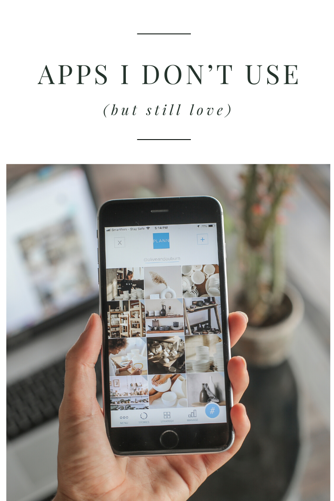

I get the opportunity to test a lot of apps and tools, but they don’t always fit well into my workflow for one reason or another. Today I want to highlight some that I think are really well designed and beautiful apps, that deserve some recognition, even if they’re not my daily drivers.

### xTiles

If Notion is too visually limiting for you, but miro is too simple, this is the perfect in-between. You can create pages, tabs, and cards with just a few clicks to help you visually organize your notes or research. If I was a student, I think this would be my go-to tool for organizing research documents. It’s great for mind maps, jotting down ideas, or planning projects.

I tend to prefer using one tool for all things, so for me, Notion fulfills this role, but xTiles is a wonderful alternative if you want something a little more flexible and with drag-and-drop features.

![[https://xtiles.app/]]

### Milanote

In a similar vibe, milanote is a visual note app much like xtiles. Again, if you’re someone who likes to organize things visually, this might be a good option (Or if Notion is just too much data). Milanote also has a drawing feature which might be just what you need if you use a tablet and pencil or prefer to see your notes in your own handwriting.

![[https://xtiles.app/]]

### mymind

This one is such a unique approach to notes and bookmarks. If you’re someone who doesn’t want to structure entire notion databases or use complex templates to organize your life, this tool might be exactly what you’re looking for.

Notes and bookmarks are tagged and easily searched within a master “mind”. Everything you want to note, remember or save is beautifully displayed and easily found without a folder system or detailed organization. You can create 100 cards for free so that you can test it out for yourself.

![[https://xtiles.app/]]

### bento

[Francesco D'Alessio](https://medium.com/u/c58823d6744) created this app and WOW, it’s beautiful. It works in conjunction with your existing productivity system and helps you start each day with purpose. The main reason I’m not using this one is that the Android version hasn’t yet launched, and without it on my phone, I simply don’t use it enough.

If you struggle with overflowing to-do lists, this is well worth checking out.

![[https://xtiles.app/]]

### ToDoist

This has been the app I’ve used for years and years, but recently, I’ve found Sunsama replaces it for my needs. If you want a simple and easy-to-use task app, you probably have already heard of, tried, or use this one. I still love this app and it’s still my favorite stand-alone task app of all time.

![[https://xtiles.app/]]

### Shift

Another tool I used for over two years is Shift. It combines all your tabs into a pretty and easy-to-use interface. As someone who works from home and needs access to multiple emails, tools, and accounts, this was such a beautiful solution to quickly access it all. The one downfall is that it slowed my computer down way too much to be a consistent driver for me. Granted, I keep A LOT on my computer, so it will likely be just fine for a majority of users, but I just couldn’t get it to work as quickly as I needed it to.

![[https://xtiles.app/]]

### CoSchedule

The last one is a tool I used for almost 3 years. Since I no longer work as a VA, I don’t need to use the system, but if you’re a business owner, social media manager, or virtual assistant, CoSchedule is amazing. You can schedule your content across multiple platforms, work with your team, and view tasks and projects all in one beautiful calendar.

![[https://xtiles.app/]]

_Do you have any apps that you don’t use, but you’d still recommend to people? Let me know, I love hearing the hows and whys of each person’s unique workflows._

* * *

__
