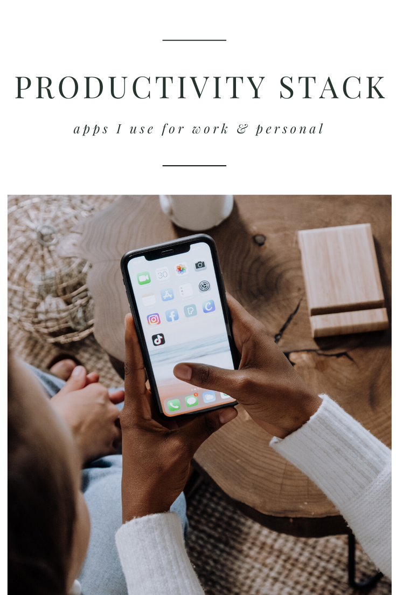

I’ve been on the hunt over the last few months for pieces to my productivity puzzle. I have a strange combo of apps and tools I use for work because I’m a content creator and have a regular office job as well. I try to find apps that can work with BOTH positions and make that transition easier to make, but as I’ve begun accepting that not every app will work for both jobs, I’ve become a lot happier with my setup.

Today I want to share the tools I currently use as a content creator and what tools I use as a logistics account manager (and what I still use for both)

### All-purpose apps

#### GSuite

I use google’s business suite for both my day job and business accounts. I also use Google for all my personal accounts. This makes it super easy to use Gmail, Google Calendar, Google Drive, and YouTube across the board. While there are some downsides to being so reliant on one platform like this, overall I’m happy with the experience and don’t plan on changing things anytime soon.

#### SideKick Browser

This is a newer addition to my stack and one I gladly pay for every month. [Sidekick](https://join.meetsidekick.com/uszdi) is a super clean browser that makes it incredibly easy for me to switch between multiple accounts, set groups of tabs, and have all the classic google chrome extensions in one browser. It’s freaking fast and has a beautifully designed setup.

#### Raycast

I recently replaced Alfred with this app because [Raycast](https://www.raycast.com/) feels like Alfred’s updated sibling. All the functionality I need is built into Raycast but it has a much better onboarding process. If you’ve downloaded Alfred but never found yourself using it, this might be a really great app to check out for your Mac.

#### Alt Tab

[This](https://alt-tab-macos.netlify.app/) is my go-to for switching tabs and windows quickly on my Mac. I have one 30" curved monitor, so I try to keep my screen clear of clutter and focus on one thing at a time. However, this simple app makes it super easy to switch between views without using my mouse.

#### Dropzone

This might be one of my most used apps that I never knew I needed. [Dropzone](https://aptonic.com/) allows you to download, move, copy and send files in seconds without having to navigate through folders to find what you need. I also use it to resize images, shorten URLs, upload my videos to YouTube, and much more.

#### Rocket

Rocket is another simple app that has saved me a lot of time. I already used emojis and the keyboard shortcut regularly, but Rocket makes it even easier and for a small price, I can now quickly access ASCII emoticons, symbols, & glyphs, customize my emoji shortcut names, add snippets, and even gifs.

This might seem like a small addition for something that can be somewhat replicated in the Mac keyboard shortcuts, but this app makes it so much easier that it’s worth the download.

#### TickTick

While this is not my favorite app in my stack at the moment, it’s what I’m using for tasks. I am still on the hunt for a Calendar/Planner, Task, and Notes app in one that works the way I want. The combo of TickTick and Obisidian is filling this gap for now, but I’d love some suggestions on any apps that might fulfill this. (I’ve tried Notion, Sunsama, ToDoist, Asana, Apple Notes/Reminders, Routine, Evernote, and some others but they fall a bit short for me so far).

#### 1Password

If you’re not using a password manager by now, you need to get on this TODAY. After being a long-time LastPass user, I switched to OnePassword because of the ease of use with iOS, and I’m loving it. I set up vaults for my personal stuff, family stuff, extended family, and work. It’s super quick and easy to set up and it’s saved me hours of time setting up accounts, filling in forms, and remembering logins.

### Content Creator

I have my website, blog, courses, and YouTube channel as a side gig. I’ve been running my business for 10+ years now and overall I’m pretty pleased with this stack.

#### Obsidian

This might be the ONE thing I’d change in this list only because I am not smart enough for it. I love taking notes and building ideas here, but after switching from Notion, I just want something in between. I’m happy with the privacy settings and offline mode with Obsidian, for now, so I’m sticking to it. If you have other suggestions though, I’d love to hear them.

#### Medium

Need I say more? Medium is such a clean and easy platform that supports writers and I’m loving it. I switched my blog to this last year and never looked back.

#### Podia

I LOVE PODIA. I wrote about them [here](https://blog.noraconrad.com/podia-takes-on-yet-another-role-7250e624b3a7) and [here](https://blog.noraconrad.com/why-podia-is-my-favorite-host-for-courses-445398566ac8) but if you’re not familiar, I use this to host my courses, products, newsletter, and recently, my website. Podia has some of the best customer services of all time and its resources are unmatched when it comes to supporting creators and helping them thrive. I adore this company.

#### TubeBuddy

This is an absolutely vital piece of planning content, posting my videos, and generating good tags for my YouTube channel. I have been using [TubeBuddy](https://www.tubebuddy.com/noraconrad) for YEARS and although I know there are a few options like this, I’ve never had any reason to switch.

#### Cleanshot

This is the app I use to film my videos and take screenshots — but it’s just SO well designed and works so well with Raycast that I paid for the app without hesitation. Matt with A Better Computer made a great [video](https://www.youtube.com/watch?v=R1ZJk1Qci6Q) about this if you need a deeper look.

#### Elgato Stream Deck

I’m not a streamer but this tool has been one of the best additions to my desk for productivity. I have app shortcuts, shortcuts to add email signatures, quick buttons to turn on lights, edit volume, play music, open multiple tabs at once, timers, and more. You can really use any macro-keyboard to do a similar thing, but Stream Deck makes it easy to customize and there are a lot of videos and articles around it that can help you get started. (There’s a free trial on the app version you can use on your phone if you want to test it before investing).

### Account Manager

We use a lot of different tools like SPS Commerce, Gorgias, Amazon Vendor Central, and various others to run our business, but the apps I’ve actually chosen and use for my role specifically are as follows,

#### Notion

For team projects, our step-by-step onboarding wikis and tracking client data, Notion just makes it so dang easy (and cheap). We started using this in 2020 and have built a really fantastic workflow here that our clients and team use daily.

#### Shipstation

We process anywhere from 50 to 2000 orders per day, and we needed a system that would allow us to connect to our client’s websites without any complicated setups. Shipstation saves our clients a TON of money on shipping and we can easily run reports, process orders, and check customer details without having full access to our client data.

#### Iorad

This is a freemium app that we use to create training modules for our team and for our clients. It takes screenshots of your workflow and then lets you organize it into step-by-step slides in just a few clicks. It’s super easy to use and we rely on it heavily to onboard new people.

**_What’s in your app stack that you couldn’t live without? I’d love some recommendations for an all-in-one planner app (tasks, notes, and calendar), so leave them in the comments if you’ve got anything good)._**

* * *

_👏🏼 If you found this article valuable hit those clapping hands once or twice._

_💻 If you want to support my work and thousands of others, consider signing up for Medium. (If you sign up using_ [_my link_](https://medium.com/@noraconrad/membership)_, I earn a small commission.)_

_✨ Thank you for reading & for your support!_
