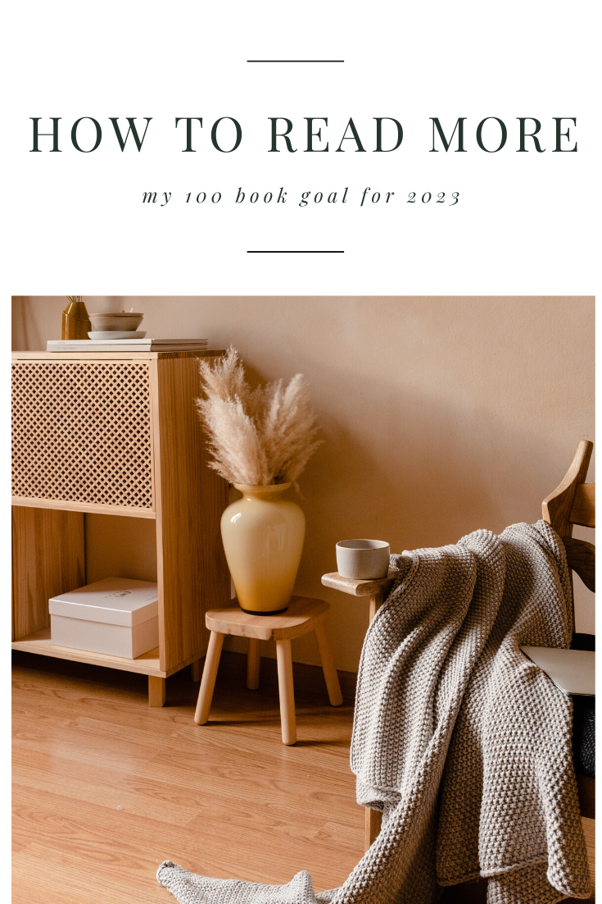

### New Year Goal: 100 Books

One of my biggest goals for the 2023 year is to read a whole lot more. This year I set a new personal record by completing [61 books](https://www.goodreads.com/user/year_in_books/2022/27074297) (actually, a few less because there are a couple DNFs in the mix). I read the biggest chunk at the end of 2022, which has now given me the confidence that I can keep this train moving for an entire year.

### How to actually read that much

In order to read an average of 2 books per week, I need a plan and some good reading habits to make it happen.

**I’m reading both physical books and audiobooks** to give myself the most flexible reading schedule as I can. (If you think audiobooks are cheating, then we can compromise and I can tell you you’re wrong and to chill out, this isn’t a competition.)

I have the benefit of working from home, so in the mornings, I get at least an hour before my kids are awake, where I can answer some emails, do some work and listen to a book while I do it. Sometime I even get two hours if I’m lucky. I can also (usually) listen to books throughout the day, which means there are times in 2022 I’ve finished a book a day… more on this in a moment.

I also have kiddos that are asleep by 7:30pm each night, sometimes earlier depending on the toddler, so that gives me another hour or two at night to pick up a physical book and read before bed.

When I’m working (Monday-Thursday) and my daughter is in school, our schedule is normal, my son is napping — I know what to expect from my routine, and I tend to get through a book in a day or two. However, during holidays, on the weekends, when our schedules get thrown for a loop or a kid is sick — reading is often the first thing I put on the back burner. Since I know this about myself, I can’t rely on the perfect “2 book a week” plan, and I know there are going to be months where I get through 25 books, and months where I read 3 books. That’s ok, I’m planning for that, and my goal is to basically read as much as I can and stop when I need a break.

### Other small habits

Have you ever tried to read along with an audiobook? You may notice the reader is much slower than your own brain. This is why **I listen to almost all audiobooks on 2x speed**. Don’t judge me, once you try it, you won’t be able to go back without feeling like you’re listening to a snail read to you.

**I bring books with me EVERYWHERE**. On car rides, to the bathroom, to pick up my daughter from school… ok, admittedly, I don’t get out much… but anytime I could scroll through instagram or check my phone, I read instead. It’s amazing how many 5-minute pockets of time we waste in a given day that can be used to hit our goals.

**Find books you actually like**. Not every book you read has to be a classic or a self-help book. I’ve read some great thrillers, rom-coms and YA fantasy that I never would’ve picked up if I hadn’t been reading so many books in a year. I am still a complete book snob at times, and I am trying to read more classics this year, but there are plenty of “trashy” books in the mix that are just plain fun to read.

**Reading more makes you a better reader and a faster reader**, so really, this is all just skills building each other up as you go. If you’re trying to get faster at reading try reading in chunks (use a pomodoro timer), work on turning off your inner monologue, and use your finger to point as you read each word.

### It’s just math in the end

Let’s say your average book is 400 pages. The average person’s reading speed is 300 WPM, that would put you at 2.8 hours to read 100 pages. So, on average, one book takes about 11.2 hours to read.

**If you can dedicate 1 hour and 36 minutes of reading per day, you’ll finish 1 book a week.**

Now, throw in that you might be a faster reader. Or maybe the book is shorter than 400 pages. Or maybe you had an extra hour to read on Saturday so you finished it a day early. Now assume that you listen to an audiobook, and you work 8 hours, and you listened to the book all day at work on 1.5x speed so you finished the book in one day. You can see how quickly two hours of time toward a hobby becomes well over 52 books in a year.

* * *

100 books is my goal, but yours doesn’t need to be that high to read more this year. I’m in a phase of life where I don’t get out much. I have young kids that don’t need me to be in deep conversation with them all day. I have a job where I can listen to books while I work. My circumstances in 2023 are perfect for being able to set a huge reading goal — yours might not be.

I absolutely love reading and I love that it’s become more popular in our post-pandemic world. Whatever your goal is this year, I hope you find some books that make you laugh, make you cry and make you want to jump straight into the world.

Happy reading.

* * *

__
