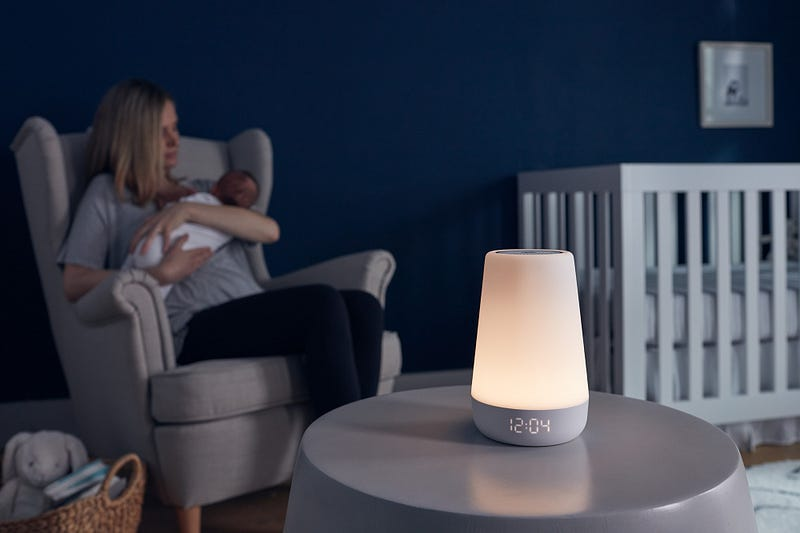

For almost a year after my son was born, I slept like 💩. A toddler and newborn didn’t help, but even when both kids began sleeping through the night, I would wake at irregular hours, take two hours to fall asleep, or sleep hard but wake up feeling groggy.

I tried all the free stuff — turning my phone off an hour before bed, working out during the day, taking a warm bath or shower before bed, sticking to strict schedules and routines. Then I started with some tools; a sound machine, better pillows and blankets, setting the house to the perfect temperature, fans, meditations and sound scapes, I even used a melatonin supplement in an attempt to get back on track.

Finally, 14 months after my son was born, I feel like my sleep is back on track and I don’t feel like a zombie when my alarm goes off. Here’s what I bought and did that I helped the most.

### The Bedtime Routine

I think with some thought and honesty, you probably know how many hours of sleep you need to feel well rested. As much as I wish I was a 6 or 7 hour person, anything less than 8 hours a night has me feeling less-than-spectacular. So, instead of fighting this, I created a schedule that would make 8 hours easy. I am in bed with lights out by 9pm, and my alarm is set for 5am, this goes for my weekends as well.

1 hour before bed, I turn off my computer, and I’ll grab my notebook to jot down any important tasks, todo’s or things on my mind for the week. Then, I pop in my headphones and either listen to the Dwell app or a headspace meditation, sometimes both. While I listen, I get my outfit out for the next day, finish cleaning up downstairs, dim all the lights in my room, and get my teeth, skin and hair care routines done. 30 minutes before bed, if my mind still feels active or if I feel stressed, I’ll take a melatonin supplement. I use the [Care Of](https://takecareof.com/invites/scy6y1) sleep blend. Some days are busier than others, so if I feel pretty tired, I’ll skip this.

Right before bed, I’ll do some stretching, then I turn on my sound machine, put on my sleep mask and listen to my bedtime meditation:

#### Sleep Mask

Ok, it’s a little goofy. But, I swear this [Manta Sleep Mask](https://bit.ly/3UDQLpr) (_affiliate link_) is the most comfortable thing I’ve ever had on my head. I’ve tried silk, cooling, heated, blackout, comfort, random ones I bought in an airport when I realized I forgot to pack one. I love me a sleep mask, but the Manta one is the only one that I can put on at night, and wake up with it still in place in the morning — not just because it stayed in place, but because sleepy me didn’t whip it off in the middle of the night due to discomfort. I initially tried it as a freebie from the company looking for some affiliates, but after trying their standard one and being hooked, I ordered the weighted one and found it to be one of the best purchases I’ve made in the last year.

#### Hatch Sound Machines / Night Lights

We got a [Hatch](https://www.hatch.co/) lamp as a baby shower gift with my daughter, and now we have three in our house, including one in our master bedroom. You can set schedules, pick from a variety of sounds, colors, brightness and volumes — and they have a bunch of different versions ranging from sound machines only to full-on alarm clock systems. It’s a super gentle way to wake up and a simple way to teach kids routines.

#### Dwell and Headspace

[Dwell](https://dwellapp.io/) is a newer app I’ve been using for meditation and sleep sounds. There are a ton of voices and versions of the Bible that are read to you with background sounds or music. The app is beautiful and they have bedtime readings that are so easy to drift off with. If you’re not looking for a Christian app, [Headspace](https://my.headspace.com/modes/meditate) was my go-to for over four years. Their sleep wind down was the only thing that would put me to sleep when I was pregnant and their app in general is really well thought out.

I also got my family on a good schedule. Although my kids were finally sleeping through the night, they would wake up at random times, ranging from 4am — 8am. When we got then on a solid bedtime routine, and set up their Hatch night lights to turn green at 7am, they started to understand that at seven, we would get them up. Knowing when everyone would be in bed and when everyone would be up was one of the most stress-reducing things we did during this time. It has worked incredibly for our kids (4 years old and 14 months old) and they stick to their schedules like magic. With the exception of being sick or some particularly rough teething nights, both of them have slept through the night and slept until 7am for the past three months.

### Got my environment on track

While keeping a good routine is helpful, I found that some changes in how we use our bedroom also needed to change. First off, we took down the TV in our room, we hardly used it anyway, but removing it immediately made our room feel more peaceful.

I also moved my workspace away from my bedroom. I set up a desk in our living room instead, so now our room would only be used for sleep. This shift, I think, made the biggest difference for me. My room became a space only for sleep and my brain really caught on to that quickly. While this might not be possible in every situation, defining the separate spaces (aka not working in bed) might be enough to get the same effect.

We also changed the lighting in the room. First thing in the morning, we turned on our lamps, opened the curtains and got as much light as possible. As we got ready for bed, we had our lamps shift to a soft purple/red hue and made sure the room was warm and cozy.

### The Morning Routine

Even when I was getting decent sleep, there were times I’d snooze my alarm and stay in bed longer than I should have. I realized if I was excited to get out of bed, and not dreading all the work I had to do, I’d be more likely to get up as soon as the alarm went off.

My alarm goes off at 5am and I start my morning by rehydrating. I’ve been using the [Early Bird Cocktail](https://club-earlybird.myshopify.com/a/rewards/r/gnmP6RMx) (_affiliate link_), but a tall glass of water works just fine. Then I start my Bible study, I’m following [this devotional](https://amzn.to/3WF43mB) to read my Bible in one year. Once I’m done reading, I make a cup of coffee, refill my shaker with cold water, and plan my day with my Hobonichi journal and [Sunsama](https://sunsama.grsm.io/ohcodu7jipuk).

At this point it’s around 5:45am, so I jump onto my computer and start my work. I answer emails, check customer service messages and process orders. By the time by kids are coming down for breakfast (around 7:15am, their dad gets them up and dressed), I’m usually at a good stopping point to eat breakfast with the family and take 15 minutes to get dressed and make myself presentable for the day.

Starting my morning early enough that I don’t have to jump straight into work was not the easiest thing to do, but I find it easier to wake up at 5am, than 6am, when I know I have a calm way to start my day and feel on top of my tasks rather than jumping straight into work and emails.

* * *

I’m really grateful that my kids are in a stage of sleeping well, that my husband is home in the mornings to get the kids up and moving, and that my job is WFH and flexible enough to work around my schedule. I know these things are not possible for everyone, but I hope some of my routine and tips can help you get better sleep.

* * *

👏🏼 If you found this article valuable hit those clapping hands once or twice.

💻 If you want to support my work and thousands of others, consider signing up for Medium. (If you sign up using [my link](https://blog.noraconrad.com/subscribe), I earn a small commission.)

✨ Thank you for reading & for your support!
