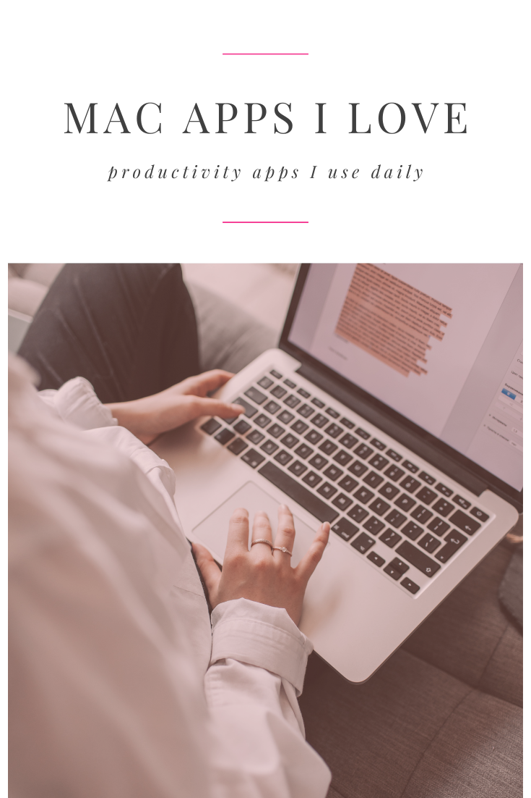

I recently got a new computer and while I was downloading all the apps and getting it set up, I thought it would be a good time to share some of the software that I use every day on my computer.

### Internet and Daily Drivers

#### 🖥️ ARC Browser

ARC Browser is a dedicated web browser that prioritizes security and customization. With built in ad blockers and their promise to privacy — I know my data won’t be sold. You can set up different workspaces with it’s own set of logins, favorites, websites and plugin extensions. You can make folders for your favorite websites and pin up to 12 for quick visits. Built in easels and notes make it quick and easy to draw, jot down notes or share an idea with friends. And you can use Boosts to customize the look of any website.

It’s a bit of a learning curve compared to Chrome or Safari but I’ve been using it since Nov 2022 and now I don’t think I could go back — other browsers just feel so inefficient in comparison.

#### 🔒 1Password

1Password is a password manager that keeps all your passwords secure in one place. It can also generate strong, unique passwords for you. If you’re not using a password manager by now, you need to get on this TODAY. After being a long-time LastPass user, I switched to [OnePassword](https://1password.com/) because of the ease of use with iOS and some annoying bugs with LP, and I’m loving it. I set up vaults for my personal stuff, family stuff, extended family, and work. It’s super quick and easy to set up and it’s saved me hours of time setting up accounts, filling in forms, and remembering logins.

I also use it for quick fill of addresses, payment methods, storing backup codes and remembering important information. It’s my go-to storage space for all my locked docs and I trust it to be secure.

#### ✉️ Airmail

Airmail is a powerful mail client with a minimal design. It supports iCloud, MS Exchange, Gmail, Google Apps, IMAP, POP3, Yahoo!, AOL, [Outlook.com](Outlook.com), and [Live.com](Live.com). It’s a fairly simple app but that’s one of the reasons I love it. I’ve used gmail for so long, that I wanted a way to easily view all messages between all my accounts (my ARC browser works great for checking emails on specific accounts using the profile feature). Airmail works so seamlessly through apple that I have been using it as my go-to for my phone and desktop apps.

There are some limitations and little bugs I hope will be sorted in the future, but I’ve been using it since June 2023 and I’m really pleased with it so far, especially as a free download.

#### 🗓️ Cron

Cron is a calendar app that seamlessly connects all your accounts into one beatiful system. It sends you meeting reminders and allows you to attach meeting docs, but treats the following in special ways:

- Figma links
- Google Docs, Slides, Sheets, etc.
- Dropbox Paper links
- Notion links — this one connects directly to your notion account allowing you to browse your notes, make a new one and even prompts you to share the doc with meeting participates

The app itself is great, but the web version is also really thoughtfully designed, and they even allow [event previews](https://twitter.com/Cron/status/1644010827647975425) with ARC Internet. Here is what the company says are their most valuable features:

- **Availability sharing** — mark holds on the grid, share the slots, and schedule with ease.
- **Team overlays** — quickly overlay teammates’ calendars.
- **Time zones** — add as many as needed, drag & drop to quickly “travel” to places.
- **Multiple accounts** — unify work and personal calendars in one place.
- **Menu bar calendar** — tightly integrated; see and join upcoming meetings in seconds.
- **Speed, multi-select flows, keyboard shortcuts, and gorgeous light/dark modes.**

Google Calendar is great, but again, this is my go-to app on my phone and desktop to give me an overall view of my day-to-day schedule and to set up appointments.

### Productivity and Notes

#### ☀️ Sunsama

I will never stop talking about Sunsama because they are still my favorite planner app on the market. I plan my days here and it helps me maintain a realistic schedule in terms of tasks. I run all my tasks, plans, appointments, and emails through Sunsama. With two businesses, client work, school, and kiddos, this is the only way I’m maintaining some sanity.

#### 🗃 Notion

Notion is an all-in-one workspace where you can write, plan, collaborate, and get organized. It’s like having a collection of tools in one app. I currently use Notion to plan and house all my content creation but as time goes on, I’m more and more inclined to move on to the next app…

#### 📙 Reflect App

The Reflect app is a digital tool that enhances your productivity by acting as an external brain, storing and organizing your thoughts, ideas, and tasks. It’s designed to help you offload cognitive work, freeing up mental space for creativity and problem-solving. The app’s intuitive interface and powerful features make it easy to capture, manage, and retrieve information, turning it into a reliable partner for personal and professional productivity. The beauty of the Reflect app lies in its ability to adapt to your unique workflow, making it an indispensable tool for anyone looking to boost their productivity and implement a second brain system.

This quarter, I’ve moved to planning my content within the Reflect app and being able to seamlessly interconnect my notes and tie in past content has been a game changer for my process. I am still working out how to best organize various topics and content but I think this will replace Notion in the next few months. I’ll be writing a dedicated post on my setup in Reflect in the next few weeks because I feel like I’ve finally cracked the code on a perfect note system.

#### 🫳🏼 Dropzone

Dropzone makes it faster and easier to move and copy files, launch applications, upload to many different services, and more. I use this to send files to my phone, upload YouTube videos, change file sizes on images and PDFs, and to shorten URLs or save websites to various apps. It’s such a simple and powerful app, it feels almost native to the Apple Ecosystem

#### 👩🏼‍💻 Raycast

Raycast lets you control your tools with a few keystrokes. It’s like Spotlight on steroids. This is how Spotlight should have been designed. From a quick calculator to multi-step functions, Raycast acts as a shortcut tool for pretty much anything you can dream of. If you really want a look at what it can do, I’d recommend just exploring their [store of apps](https://www.raycast.com/store) and integration options.

#### 🚀 Rocket

[Rocket](https://matthewpalmer.net/rocket/) is another simple app that has saved me a lot of time. I already used emojis and the keyboard shortcut regularly, but Rocket makes it even easier and for a small price, I can now quickly access ASCII emoticons, symbols, & glyphs, customize my emoji shortcut names, add snippets, and even gifs.

This might seem like a small addition for something that can be somewhat replicated in the Mac keyboard shortcuts, but this app makes it so much easier that it’s worth the download.

### Video and Editing

#### 📹 [Tella](https://tella.tv/?via=nora)

Tella is a software tool that combines screen recordings and camera footage to help you create stunning videos. You can trim, split, and delete unnecessary parts of your recordings, ensuring that your final video is polished and concise. I use it for training, webinar videos, and social media posts.

#### 🎬 Final Cut Pro

My go-to video editor for long-form content. I use this for all my YouTube videos and for the more complex social media posts (or for breaking up longer-form content into small cuts).

* * *

