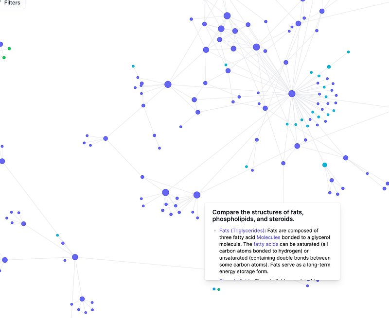
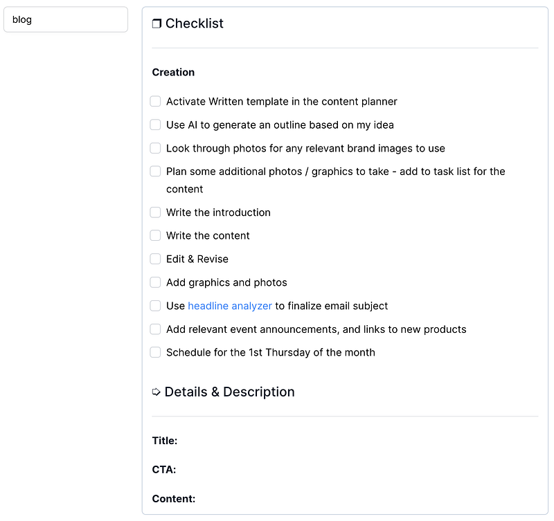

Just 6 months ago, I shared my process of filtering through, identifying needs, and seeking out my perfect notes application. I ended up with RemNote, a fantastic tool that really did meet all my needs. The problem is, I barely ever used it.

\[embed\]https://blog.noraconrad.com/i-finally-found-my-perfect-notes-app-7047d69b7fd4\[/embed\]

### The Switch

Here’s the problem — while the app met all my needs, I didn’t enjoy using it. There was something about the UI that I didn’t love and it just felt like it had a ton of features and menus that I never needed and never took advantage of. I seriously considered switching to the Apple Notes app for a good while because I just wanted something that was quick and easy. However, after only using the Notes app for two weeks, I missed the interconnecting that made RemNote so fun to use in the first place.

I decided to go back to my blog post and re-consider some of the features I really wanted. I had used one app — Reflect — for a few months before ultimately switching due to the lack of folder systems. However, when I checked it out again, I realized I just never gave it the chance to really develop into what it could be, which is the perfect notes app for me in this phase of my life.

So no, the Reflect app doesn’t give you the ability to create folders — However, I quickly realized by just interconnecting multiple collections of notes together, I could make my own “folder” structure and it actually gave me a lot more freedom than typical folders would.

Part of the reason I fell in love with the Reflect app in the first place was its simplicity and features that felt like vanilla Obsidian. It took a couple of weeks of exporting, filing, organizing, and using — but Reflect has become a daily driver for me over the past 8 weeks and I don’t know if I’ll ever look back.

### The Setup

I want to share how I’m using Reflect to hopefully inspire you to try it out and also to give you some ideas for structure, regardless of what note app you call home.

#### Pinned Notes

This is the highest level of my “folders”. I have 10 and try to keep that number as low as possible. The idea is that each “job” I have gets a specific folder — so the job of mom, student, business owner (x2), and virtual assistant (x2) gets their own folders. I also have a master list of my content calendar (so that I can keep track of what I’m posting across all my platforms) and my Misc file. Things like book notes, interesting articles, or ideas to explore all live in the Misc file until they are assigned to another home or archived. While I do have an Archive file, this really only serves as a master list of my “top-level” notes that I’ve used in the past. For example, our Basement Remodel project lives in the Archive. We are done with the project, but I’d like all the notes to still be grouped together on my mind map and be easy to find if I ever needed to get a receipt or phone number.

The 2023 Goals file is also unique because I use it as a daily journal, habit tracker, and progress plan for the goals I make each year. This also eventually becomes my annual review hub and a place to look back at as I begin a new year.

#### Interconnecting as much as I can

One of Reflect’s best features and greatest strengths is the ability to interconnect notes using \[\[ brackets \]\]. Each connection becomes its own “page” and can be found in the search bar, mind map, or through backlinks.

Because my jobs, hobbies, and interests have so many overlaps, I like to use this feature as much as possible. This makes it super easy to write blog posts, take actionable steps on goals, and link the content I consume to the content I create or the plans I make.

By using interconnected notes through tools like the Reflect app, you can capitalize on the human brain’s capacity for associational thinking, allowing you to enhance your understanding, creativity, and productivity across multiple areas of your life. By visually linking ideas and topics, you’re not just taking notes — you’re building a personalized knowledge ecosystem that allows you to navigate the complexities of your work, studies, and creative channels in one giant map.

#### Taking Notes ALL DAY

I take notes on _everything._ I take notes for school, I take notes in meetings, I journal every morning, I take notes and highlights on my Kindle, I save articles and quotes, and ideas. I brainstorm my content, I keep lists of apps I’ve tried, and I jot down random thoughts in the line at the grocery store. Notes are my favorite way to get thoughts out of my head and into a system I trust.

The keyword here is trust. If you don’t have a notes app you love and you know you’ll be able to use it effectively, you won’t use it.

### Reflect Features

Ok, enough about me and my system. Let’s talk about the app itself.

**Interconnected Pages:** This allows users to create links between different notes, ideas, and topics, forming a web of information. For students and professionals, this feature helps in connecting concepts across subjects, projects, or tasks, fostering a holistic understanding of their work.

**Visual Mapping:** Reflect enables visual mapping of information through its interconnected structure and the map view. Users can see relationships between ideas at a glance, helping them identify patterns, dependencies, and opportunities for creativity.

**Flexible Organization:  
**The app provides various ways to organize notes, including tags, categories, and folders. This versatility benefits individuals who need to keep track of a range of topics or projects. Students can categorize notes by subjects, and professionals can use tags to label notes related to specific clients or tasks.

**Template Creation:** Using the [template feature](https://reflect.academy/using-templates) in Reflect is a great way to take advantage of the note formats you use most often. Some of my templates include meeting notes, blog post templates, YouTube templates, prayer lists, and project outlines.

**Publishing and Exporting:** Being able to share your notes or move them freely was really important to me. Reflect allows you to [publish notes](https://reflect.academy/publishing-notes) or [export them](https://reflect.academy/import-export-backups) with ease.

**Integration with Digital Tools:** The Reflect app integrates with other digital tools, enhancing its functionality some of the current integrations & features include:

- [Chrome Extension](https://chrome.google.com/webstore/detail/reflect/kljfphapkgkjaiiddfmfpbdmeaplojge)
- [Readwise and Kindle connection](https://reflect.academy/integrations#5a45cb6906354d28bc27672ed3f28e67)
- [Zapier Integration](https://reflect.academy/integrations#ecf6a42b7b4b4b6697d0544ab410f1c2)
- [Open API](https://reflect.academy/api)
- [Calendar & Contact Connection](https://reflect.academy/calendar-and-contacts)
- [iPhone and desktop app](https://reflect.app/download)
- [Audio Recordings](https://reflect.academy/audio-recordings)

### Final Thou**ghts**

In my hunt for the perfect note-taking app, my journey led me through a multitude of options, each with its own promises and potential. Not long ago, I enthusiastically shared my discovery of RemNote, a tool that seemed to align perfectly with my needs. Yet, in a curious twist, I found myself barely engaging with it. The realization that functionality alone isn’t enough dawned upon me — the user experience matters.

Among the sea of contenders I explored, ranging from Notion to Obsidian, Reflect eventually re-emerged as a contender. Initially overlooked due to the absence of folder systems, Reflect’s distinctive interconnected note feature begged reconsideration. While it doesn’t offer folders, I soon grasped that the power of interconnecting multiple collections brought about a newfound sense of organization and freedom, transcending traditional hierarchical structures.

Finding apps that you use and love is not just about ticking checkboxes of functionality; it’s about feeling an affinity with the tool you entrust your thoughts to. Reflect, with its interconnected features, has etched itself into my daily life as a reliable companion. As my note journey continues, I can say with confidence that I’ve found an app that not only meets my needs but is fun to use and explore.
