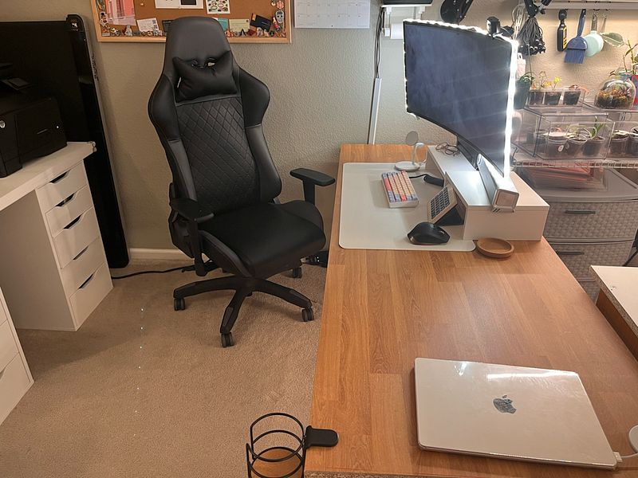
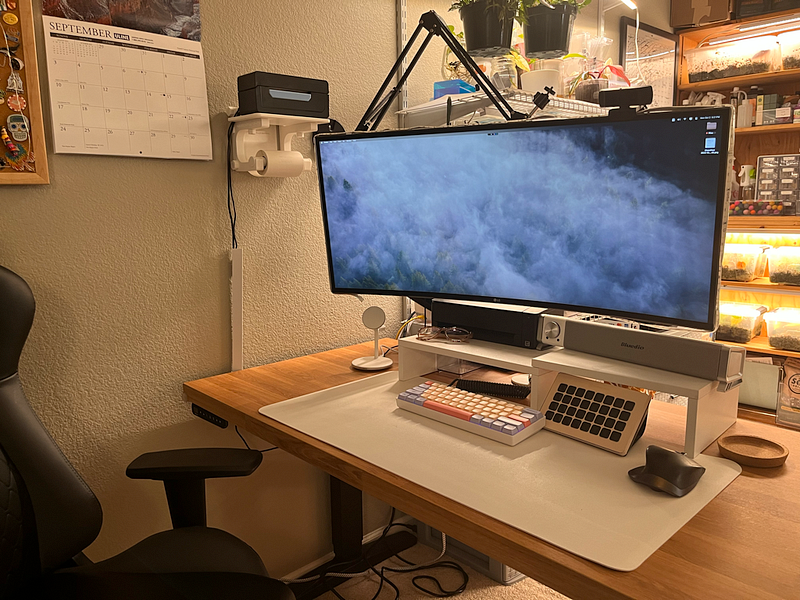
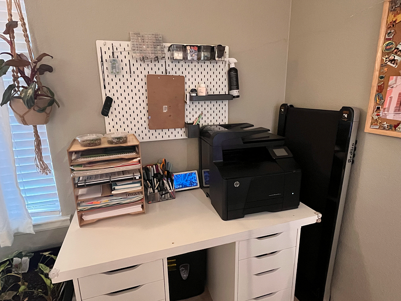
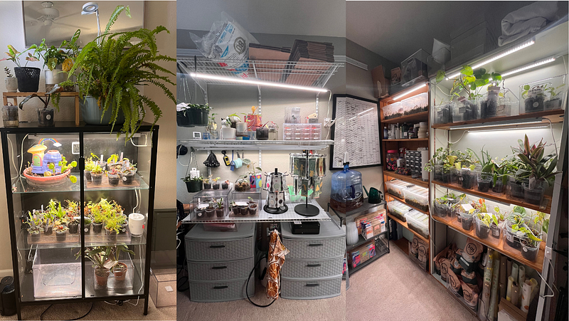

I’m a sucker for desk tours. I love seeing how others set up their workspaces and what fun gadgets they invest in to make their space a little more comfortable or productive.

I’ve been working from home since October 2021 after my son was born. After almost a decade in a shared office space, I finally had my own room to do whatever I wanted with it. None of what I’m about to share is necessary in anyway, shape, or form — but it’s fun and I’m going to share it anyway.

_Note: most of these are affiliate links, but only because it’s mostly on amazon — I wasn’t paid to list any of these products specifically, these are truly what I use in my home._

### The Desk

I got my standing desk as a frame from Uplift. I ordered the [V2 C frame](https://www.upliftdesk.com/uplift-v2-standing-desk-frame/) and used a [butcher block](https://www.ikea.com/us/en/p/saeljan-countertop-oak-effect-laminate-30439216/) from Ikea as the desktop. We ended up cutting it down to around 76" in width and have the frame set around 68" so there is an overhang. We also added two of these [desk grommets](https://amzn.to/3RG5n94) for cable management. It has held up really well over the past year of use.

Behind me are two [Ikea Alex Drawers](https://www.ikea.com/us/en/p/alex-drawer-unit-white-00473546/) with an [MDF panel](https://www.homedepot.com/p/Veranda-3-4-in-x-4-ft-x-8-ft-Melamine-White-MDF-Panel-461877/100070209) from Home Depot to make a spot for my printer, paper and pens, more on this in a bit.

Cord Organizers came with the Uplift, but I also use [this power strip](https://amzn.to/3EZEO76), these [cable ties](https://www.amazon.com/gp/product/B07V73G556) and [this docking station](https://www.amazon.com/gp/product/B08HM1LF9P) to add additional accessories to my Mac.

### Computer Setup

I use the [Mac Mini](https://www.apple.com/mac-mini/) as my daily machine. It is mounted under my desk with [this mount](https://www.amazon.com/gp/product/B082XHZLQ8?th=1) and has been a really good investment. My dad gifted me this [ultra wide monitor](https://amzn.to/48rc1WC) for my birthday last year and I have been obsessed with it. I just got [this monitor arm](https://amzn.to/3EU3wpH) for it recently and I am really pleased with the look and function of these together. I have the [Elgato light strips](https://amzn.to/3PukIXq) around the monitor frame to light up my face during meetings and add some fun colors.

My keyboard is the [HK Gaming GK61v2 Mechanical Keyboard](https://amzn.to/48BC7Gs) with [Marshmallow PBT Keycaps](https://www.amazon.com/Hyekit-Marshmallow-Dye-Sublimation-Mechanical-Keyboards/dp/B09XQQDKCG) and [Holy Panda switches](https://amzn.to/3Zzxbha). I also have this [coiled cord](https://amzn.to/48qO41E) for the keyboard. I have recently fallen in love with mechanical keyboards and have my eyes on a few others, but this has been a great combo so far. I use [this desk mat](https://amzn.to/46xjUrK) and this [Logitech mouse](https://amzn.to/46cuZ1E).

### Computer Accessories

On my desk, I try to keep it pretty minimal so I have room for notebooks, projects or whatever I might be working on. I have this [monitor stand](https://amzn.to/3ZBP3rS) that holds my [Speaker](https://amzn.to/3RFNPd1) and [scanner](https://amzn.to/3RFqeth). Under it is my [Stream Deck XL](https://www.elgato.com/us/en/p/stream-deck-xl) and next to that is my multi [Charger](https://www.amazon.com/gp/product/B09SLPWZFM?th=1).

My [Jadens thermal label printer](https://amzn.to/3rwotUq) is mounted next to the monitor with [this custom mount](https://go.magik.ly/ml/1ww5r/) from etsy. I also have my [Nexigo web cam](https://amzn.to/46c7CoT) (hoping to upgrade to the [Elgato Cam](https://amzn.to/48vCQJf) soon) and extra [charging cables](https://www.amazon.com/gp/product/B07PYDT59Q?th=1) for quick charging. My [macbook](https://www.apple.com/macbook-air-m1/) charges on the end of my desk, but I eventually plan to get a stand for this as well (any suggestions?)

### Other Office (non)Essentials

This [paper tower](https://amzn.to/45apShd) has been SO handy for extra storage. I have [this printer](https://go.magik.ly/ml/1ww63/) that I stole from my dad when he upgraded, and I use this [storage container](https://amzn.to/46vLaHi) for my pen collection and Tombows. I also love the [Home Edit storage bins](https://go.magik.ly/ml/1ww60/) for organizing inside my drawers and keeping things accessable. The [Ikea Skadis](https://www.ikea.com/us/en/p/skadis-pegboard-white-10321618/) is a must have and I use it mostly to store keyboard accessories.

When we moved, I ordered myself [this walking pad](https://amzn.to/45dmXV8), and I LOVE it. I use it daily and have been much more active since getting it.

### The Plants

The rest of my office is shared with my husband’s desk and my plant studio. I run my business, Sister Sprouts, primarily out of this room so there are plants and plant accessories everywhere. If you’d like a peek at some of this, I have most of the items listed on my [Plant Studio list](https://amzn.to/42zcS4A).

This office and setup took almost 5 years to built up and even now, there are things I would love to add and upgrade. I hope this gave you some ideas for your own space and if you have any suggestions for my setup, I’d love to hear about some of your favorite purchases.

* * *

👏🏼 If you found this article valuable hit those clapping hands once or twice.

✨ Thank you for reading & for your support!
