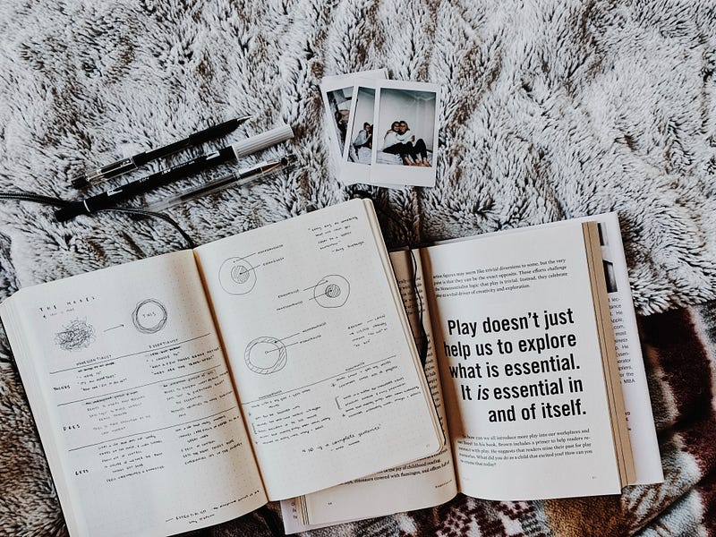

#### Take advantage of the benefits of journaling with or without writing

Have you ever felt the urge to pour your thoughts out, make sense of your world, or just ponder your existence? Or maybe you’ve been influenced by the productivity gurus to start a daily journaling habit to better your morning routine.

I have kept a journal for the past year, with almost daily entries. But it’s not written down or typed out. It’s all in audio notes on my phone.

Whether you’ve tried and failed or you love the idea and don’t know how to begin, I have good news. You don’t need to get all fancy with leather-bound notebooks or complex second-brain systems to take advantage of the benefits of journaling. Let’s keep it real and embrace the beauty of journaling in all its simple, wonderful forms.

<figure>

<figcaption>

Photo by [Noémi Macavei-Katócz](https://unsplash.com/@noemimk?utm_source=unsplash&utm_medium=referral&utm_content=creditCopyText) on [Unsplash](https://unsplash.com/photos/Af1TEGN2H9Q?utm_source=unsplash&utm_medium=referral&utm_content=creditCopyText)

</figcaption>

</figure>

### Express Yourself, Your Way

Journaling isn’t about following strict rules. It’s about you, your thoughts, and your unique journey. So, let’s ditch the pressure and embrace the messiness of being human.

There’s no “one-size-fits-all” approach to journaling. You can go old-school with a notebook, or you can chat with a friend, record voice memos, or even use those fancy guided journals. The trick is to express yourself authentically. Let your thoughts flow like a river.

Don’t overthink it! If you miss a day or a week, no biggie. Journaling isn’t a strict regimen; it’s a fluid journey. Just be intentional about it when you can.

### Let go of expectations

Forget about complexity! Find what works for you. Maybe it’s scribbling on a napkin during your lunch break, having a heart-to-heart with your BFF, or recording your midnight musings. The key is to feel comfortable and free to express your values and thoughts within the context of your chosen method.

You’re the expert of your own life. Trust your instincts and your own unique way of journaling. There’s no “right” or “wrong” here.

While Hobonichis, bullet journals, and beautifully organized notebooks litter YouTube, your journaling process doesn’t have to look like everyone else’s for you to reap the benefits of processing your thoughts.

### Understand the benefits

“Journaling” is simply a way to process the massive amounts of data that flows through our mind during the day. Recognizing the benefits of this intentional time is important if you want to make a habit of processing your thoughts.

1. **Emotional Release:** One of the most immediate benefits is the release of pent-up emotions. When you write down your thoughts and feelings, it’s like unburdening your mind. You can vent your frustrations, express your joys, and understand your fears in a safe space.
2. **Clarity and Insight:** Journaling can help you gain clarity about your thoughts and situations. As you put your thoughts into words, you often see things from a different perspective. This can lead to valuable insights and problem-solving.
3. **Stress Reduction:** Writing about stressful experiences can help reduce the emotional impact of those events. It’s a way of externalizing your stress, making it easier to cope with difficult situations.
4. **Goal Setting and Tracking:** Journaling is an excellent tool for setting and tracking your goals. When you write down your goals, you’re more likely to commit to them. Regularly reviewing your progress can keep you motivated and accountable.
5. **Self-Discovery:** Journaling is like having a conversation with yourself. It allows you to explore your beliefs, values, and desires. Over time, you’ll develop a deeper understanding of who you are and what you want in life.
6. **Improved Communication:** If you’re sharing your journal with someone, like a friend or therapist, it can improve your communication skills. It helps you articulate your thoughts and feelings more clearly, leading to better relationships.
7. **Creativity Boost:** Journaling can stimulate your creativity. When you let your thoughts flow freely, you may stumble upon new ideas, solutions, or creative projects you want to pursue. Creativity is simply the process of connecting ideas together, which can be done much easier when you have time to consider those connections.
8. **Memory Enhancement:** Writing down your experiences helps preserve memories. You can look back on your journal and relive moments from the past, which can be a source of joy and nostalgia.
9. **Reduced Anxiety:** Journaling can be a tool for managing anxiety. It allows you to confront your worries and anxieties head-on, often making them feel less overwhelming.
10. **Personal Growth:** Your journal is a record of your personal growth journey. You can see how you’ve evolved over time, which can be incredibly motivating and inspiring.
11. **Better Decision-Making:** When you have a record of your thoughts and experiences, it becomes easier to make informed decisions. You can weigh the pros and cons and refer back to past experiences to guide your choices.
12. I**mproved Focus and Productivity:** Regularly expressing your thoughts can clear mental clutter and improve your ability to focus on tasks. It’s like decluttering your mind, which can boost productivity.

Of course, there is an almost endless list of benefits to processing your thoughts (written, typed, or verbal), but what are some ways to actually start this in your daily routine?

<figure>

<figcaption>

Photo by [Kelly Sikkema](https://unsplash.com/@kellysikkema?utm_source=unsplash&utm_medium=referral&utm_content=creditCopyText) on [Unsplash](https://unsplash.com/photos/DTApL3k8Clg?utm_source=unsplash&utm_medium=referral&utm_content=creditCopyText)

</figcaption>

</figure>

### Practical Tips for “Journaling”

Begin by creating a designated space, a cozy corner where you can be alone with your thoughts — whether it’s a quiet room, a park bench, or even your car during lunch breaks. Then establish a specific journaling time that suits your schedule, whether it’s in the morning to kickstart your day, at night to unwind, or whenever inspiration strikes.

If you ever find yourself staring at a blank page, unable to think of any ideas to express, or wondering what to process, don’t fret; prompts can be your creative companion, jumpstarting your thoughts and guiding you on a journey of self-discovery. Don’t forget to revisit your past entries from time to time; it’s like flipping through an old photo album of your mind, revealing your growth and recurring patterns.

For those who are more socially inclined, consider sharing your thoughts with a trusted friend; the conversations can be therapeutic, and your friend might provide insights you hadn’t considered. If you’re tech-savvy, explore digital journaling apps like Day One or Obsidian for the convenience of journaling on the go.

* * *

Remember that journaling is a process, and you will see growth over time. Some days, you’ll pour out books worth of words, while others may yield just a sentence, and that’s okay.

Journaling is meant to be comforting and uniquely yours. So, grab whatever journaling tool feels right for you, and let your thoughts flow. It’s not about perfection; it’s about organizing your mind and making intentional time to process your own thoughts.

Keep it simple, keep it real, and keep being the wonderful human you are. Happy journaling.

* * *

