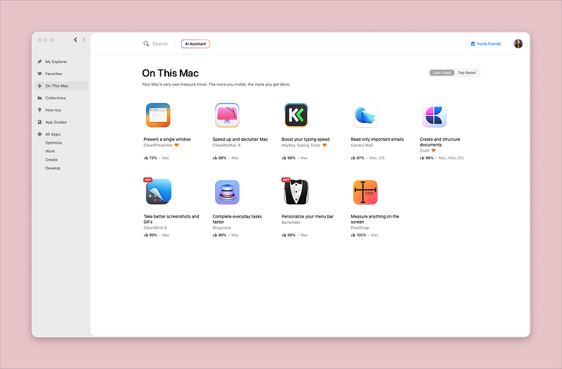
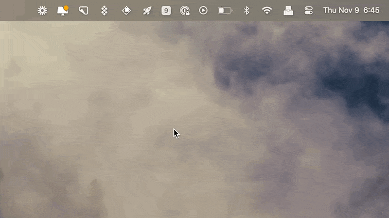
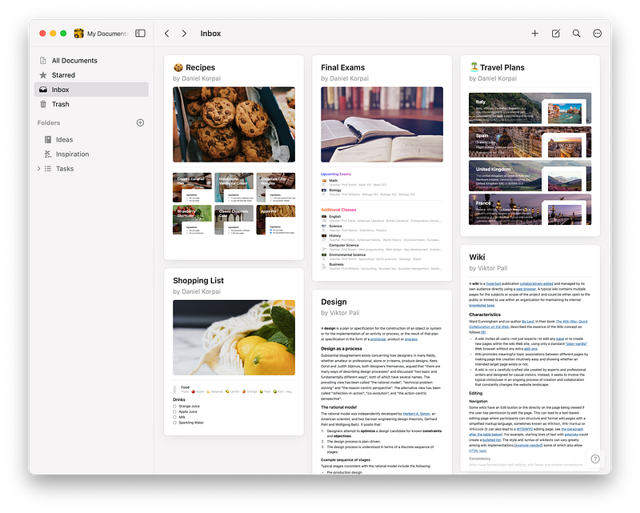
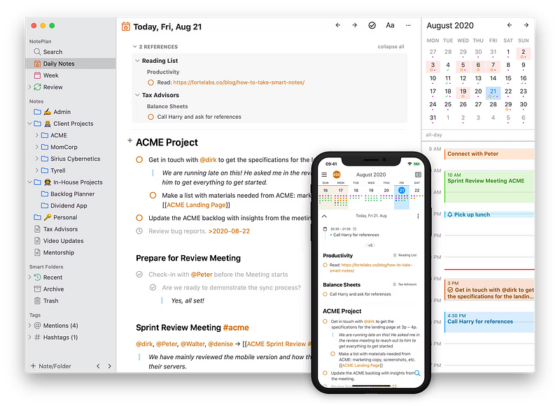
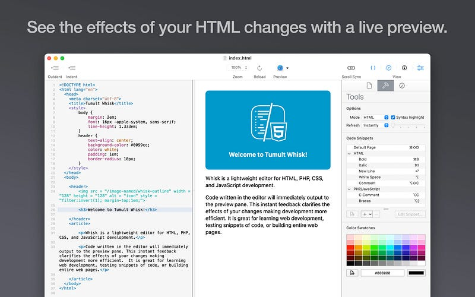

#### Setapp gives you access to hundreds of other apps for one low subscription price, but is it actually worth subscribing to?

**_Full disclosure, I am an affiliate, but you do get a 1 month free trial with_** [**_my link_**](https://setapp.sjv.io/Jz7q1r&sharedid=WSAC)**_._**

I had seen [SetApp](https://setapp.sjv.io/Jz7q1r&sharedid=WSAC) recommended by a few people, but I never really considered a subscription until this past summer. If you love productivity apps, it might be worth checking out. You get access to hundreds of apps for a monthly price starting at $9.99 — but is it cheaper to use Setapp than just subscribing to or buying the apps you use?

I am subscribed to the Power User plan at $161.88 per year (plus tax). This gives me access to Setapp on 4 Macs and 4 iOS devices. I have my Mac Mini and a MacBook Air as well as an iPad and iPhone — so this was the best option for me to use the apps on all those devices. Many of the apps I use in my workflow are single-licenses. So, if I want my laptop to mirror my Mac mini properly, I’d need to fork over double the cash.

I’ll share the apps I regularly use through Setapp and their standalone prices. These apps have become essential to my daily workflow, and I’ll explain why they’re valuable. Additionally, I’ll break down the savings Setapp has provided for me over time. If you’re wondering if Setapp is the right choice for your productivity needs, this will give you a good starting point and at least convince you to do a [free trial](https://setapp.sjv.io/Jz7q1r&sharedid=WSAC).

### Apps I Use

Below are the apps I’ve installed and use regularly with [Setapp](https://setapp.sjv.io/Jz7q1r&sharedid=WSAC), and their regular pricing is listed next to it. I use more apps than I have listed, but I wouldn’t necessarily continue using them if Setapp went away, so I decided to leave them out of this list for fairness. That being said, this subscription has introduced me to some really amazing tools I wouldn’t have used if I didn’t already have the subscription.

**01\. Bartender** — $32 one-time purchase for two Macs

Bartender is an app that simplifies your Mac’s menu bar. The primary function is to hide or rearrange icons, making your desktop less cluttered. It allows you to customize your workspace by selecting which icons should be visible, hidden, or placed in the Bartender Bar — a separate space that can be easily accessed. The end result is a cleaner, more organized menu bar that makes it easier to focus and locate essential apps. If you’re the type of person who multitasks with multiple apps open, Bartender is a fantastic way to maintain a clean workspace.

<figure>

<figcaption>

Gif from [SetApp](https://setapp.com/news/secure-email-client-for-mac) blog

</figcaption>

</figure>

**02\. Canary Mail** — $20 per year

Canary Mail takes email privacy to the next level by offering end-to-end encryption. Beyond just sending and receiving secure emails, Canary Mail features a robust set of organization tools. The app supports smart filters, focused inboxes, and email templates for quick replies. The encryption features make it an ideal choice for professionals or anyone concerned about the privacy of their correspondence.

Personally, I love the ease of combining all my work and personal accounts into one email client. It works well on all my devices and feels the closest to Gmail with a few bonus features (looking at you, AI).

<figure>

<figcaption>

CleanMyMac X is running a system junk scan

</figcaption>

</figure>

**03\. CleanMyMac X** — $180 one-time purchase for two Macs

CleanMyMac X is the one-stop solution for maintaining your Mac’s health. This app sweeps your system for junk files, eliminates malware, and optimizes your computer’s performance. With features like Smart Scan, you can quickly identify and clean unnecessary data with a single click. If you find that your Mac is sluggish or running low on storage, CleanMyMac X can free up space and improve your computer’s speed, making your workflow more efficient.

I bought this for my Mac mini a while back and considered getting it for my laptop — this is what convinced me to try Setapp in the beginning!

**04\. CleanShot** **X** — $196 per year for two Macs

CleanShot X goes beyond basic screenshot functionality. It offers tools to capture, annotate, and share images quickly. You can grab a part of your screen, add quick annotations, and then save or share the image. It even allows for video recording of your screen and gif creation, making it an all-around versatile tool for anyone needing to capture content. Whether you’re making a tutorial, presenting a project, or need to communicate visually, CleanShot X has you covered. P.S. Most of the images from this blog post were taken using this app.

<figure>

<figcaption>

Dropzone options

</figcaption>

</figure>

**Dropzone** — $70 one-time purchase for two Macs

Dropzone is designed to speed up your most frequently performed tasks. It’s a drag-and-drop utility that makes it easier to move files, launch apps, or even upload content. The app offers ‘dropzones’ on your screen where you can drag files for quick actions like moving, copying, or even converting. Dropzone can be configured to perform custom actions, making it a huge time-saver for repetitive tasks.

I use it to change image files to PNGs almost every day, but I also upload my YouTube videos this way, install apps this way, and reverse image search using Google Lens through Dropzone. It’s a tool that I think will eventually be replicated as a native app to the OS system.

**PixelSnap 2** — $69 one-time purchase for two Macs

PixelSnap 2 is a must-have for designers and developers. The app accurately measures the pixel dimensions between objects on your screen. It can detect elements within your design software or browser, making it extremely useful for ensuring pixel-perfect layout. If you’re detail-oriented and need to get the sizing and spacing just right, PixelSnap 2 is an invaluable tool.

**Sip** — $40 one-time purchase for two Macs

Sip is a color picker designed for Mac users, but it’s not your average color tool. This app allows you to pick, save, and organize colors from any screen you’re viewing. It can identify color codes in various formats, and you can even create custom palettes for specific projects. It’s especially useful for designers or anyone who frequently works with digital color.

#### It should be fairly obvious at this point, but if you’re wondering, the Setapp saves me quite a bit of money every year :

**Year 1 savings: $445+  
**Considering all the one-time purchases, the first year of using [SetApp](https://setapp.sjv.io/Jz7q1r&sharedid=WSAC) clearly has some serious savings involved. Now, you can easily pick and choose the best apps for you and then buy the licenses once, which is why I wanted to break down the savings after the first year…

**Year 2 savings: $54+**   
This is assuming I don’t start using any other apps, which I most likely will. Setapp always adds to their catalog, and my needs change over time. Not to mention, I’ve had a subscription for a few months and have probably only tested 1/10th of the apps so far.

In addition to this, having a [Setapp](https://setapp.sjv.io/Jz7q1r&sharedid=WSAC) subscription gives you access to all updates and upgrades to the apps. So, while you may buy CleanMyMac X and move on, you could find yourself dishing out another $50-$100 a few years later to upgrade it to the newest version.

It’s safe to say even after a few years of paying this subscription fee; the value of the apps outweighs the cost.

* * *

### Honorable Mentions

<figure>

<figcaption>

Example inbox from Craft’s press kit

</figcaption>

</figure>

**Craft** — $5 per month

Craft is a modern writing and content creation app that changes how you approach documents and notes. Unlike traditional word processors, Craft incorporates a block-based system that allows you to move around paragraphs, images, and code easily. This flexibility makes it an excellent choice for writers, students, and professionals who want to organize their thoughts more visually. You can also link different pieces of content within the app, making it a great tool for research or complex projects. Craft simplifies the writing process without sacrificing functionality, streamlining your workflow.

<figure>

<figcaption>

Screenshot from NotePlan

</figcaption>

</figure>

**NotePlan** — $99 per year

NotePlan merges the best features of a note-taking app and a calendar to create a unique task management solution. You can jot down tasks, notes, and reminders in Markdown and seamlessly schedule them into your calendar. NotePlan offers a unified space to manage your tasks and schedule, making it easier to plan your day and get things done. Its focus on Markdown formatting keeps the interface simple and ensures that your notes are easy to read and quick to edit. If you like to organize your tasks and notes in one place, NotePlan has got you covered.

<figure>

<figcaption>

Whisk App from Tumult

</figcaption>

</figure>

**Whisk** — $30 one-time purchase.

Whisk is a live HTML and CSS editor designed for web development. The app provides real-time previews as you code, eliminating the need to switch back and forth between your editor and browser. This live feedback can speed up development and make the debugging process more efficient. Whisk also includes features like auto-closing tags and syntax highlighting, making the coding process smoother. Whether you’re a seasoned developer or just getting started, Whisk offers a more interactive way to work on your web projects.

<figure>

<figcaption>

Code Runner app

</figcaption>

</figure>

**Code Runner —** $20 one-time purchase

Code Runner is an IDE (Integrated Development Environment) that supports many programming languages, from Python and JavaScript to more niche languages like Kotlin and Lua. One of its standout features is the ability to run code snippets or full programs without switching out of the app or setting up a separate environment. This makes it incredibly useful for testing out new code or learning a new language. Its user-friendly interface and wide range of supported languages make it a versatile tool for any coder.

* * *

So, what do you think? Do you use [Setapp](https://setapp.sjv.io/Jz7q1r&sharedid=WSAC) yourself? I’d love to know what apps are in your stack. It can be great to try out new additions to see if they can replace or improve pieces of my workflow. For a subscription-based service, I think they’re doing things right. Get a free month to try it yourself with my [link](https://setapp.sjv.io/Jz7q1r&sharedid=WSAC), and let me know your thoughts.
