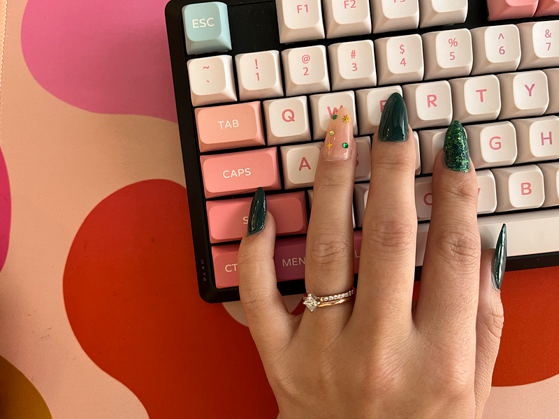

#### Productivity without sacrificing your personal life.

Sustainable work habits are essential for long-term success and well-being. By setting boundaries, practicing mindfulness, and embracing regular breaks, you can achieve a more balanced productivity without sacrificing your health and personal life. It’s about working smarter and in a way that supports your overall well-being.

### Setting Boundaries for Balance

In our increasingly remote world, it is too easy to “quickly” check an email or let work bleed into your evenings. Establishing boundaries and habits for work is important and essential if you want to be able to “turn off” and enjoy your evenings and weekends.

1\. Define Your Work Hours: Determine specific start and end times for your workday. Communicate these hours to colleagues and family members to minimize interruptions during your personal time. I have a door hanger for my office to indicate to my family when I’m in “working” hours for this exact purpose.

Add these hours to your calendar to block off those hours and treat them as you would if you were going into a physical space.

2\. Create a Dedicated Workspace: Designate a physical space for work, if possible. This separation helps you mentally distinguish between work and personal life.

Even if you can’t create a separate space, simple changes like a change in the desktop background, different lighting, or a new playlist can change the mood enough to help you focus. I use the Arc browser to separate profiles and spaces. Having my work bookmarks, extensions, and logins all stay separate with their own theme.

3\. Set Technology Limits: Establish boundaries with technology by turning off work-related notifications during non-work hours. This prevents constant connectivity and allows you to recharge.

This also makes boundaries easy to keep since you won’t be notified of those who work different hours or schedules.

### Practicing Mindfulness

Mindfulness is a powerful tool for enhancing focus, managing stress, and improving overall well-being. When practiced regularly, these simple routines can be a great way to ease stress during the workday.

1\. Start with Breathing Exercises: Take short breaks throughout the day to focus on your breath. Headspace is a great app for guided meditation if you haven’t tried it before. Initially, it feels silly, but it can slow your heart rate.

2\. Mindful Task Switching: Switching can slow your flow and take a lot of mental energy, so minimizing switching can be an effective way to be more productive during the work day. I use apps like Sunsama to plan my day and time block, so I’m less likely to get distracted by notifications or emails. You can practice single-tasking, focusing on one task at a time. This boosts productivity and prevents the mental fatigue that often accompanies multitasking.

3\. Mindful Eating: Pay attention to your meals. Avoid working while eating and savor each bite. This promotes better digestion and a mental break. Working through lunch when you’re in a good flow or have a lot on your plate can be tempting, but taking time to energize your body will make you more effective.

### Importance of Regular Breaks

Taking breaks isn’t a sign of laziness; it’s a necessity for sustainable productivity. Breaks matter, so how do you make the most of them?

1\. [Research shows](https://workplace.msu.edu/breaks-during-the-workday/) that short, regular breaks improve focus, creativity, and overall work quality. Our brains need moments of rest to perform at their best.

2\. Consider using the Pomodoro Technique, which involves working in focused intervals (typically 25 minutes) followed by a short break. This structured approach can be great if you struggle with time management.

3\. Incorporate short physical activity breaks into your day. Stretching, a brisk walk, or even a few yoga poses can reenergize your body and mind. I’ve been using a walking pad since early 2023, and it’s been a huge help in getting more steps in my day and keeping me more active.

4\. Use your breaks to disconnect from work completely. Avoid checking emails or work-related messages. Instead, engage in activities that relax and rejuvenate you.

* * *

