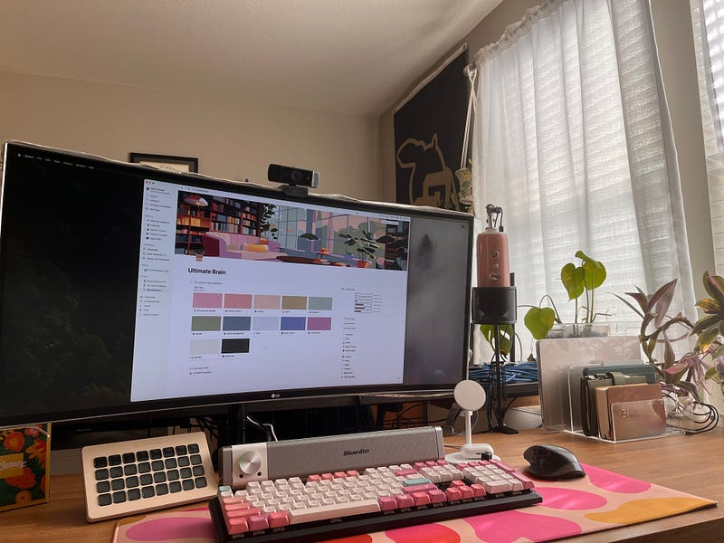

#### WFH and remote parents, what are you doing??

I work from home, part-time, with my 2-year-old son here all day. My 5-year-old daughter attends preschool, and we pay for an extended day for $400/mo to have her in school from 8 am — 2:45 pm Monday through Thursday. I am contracted to work 130 hours a month, which averages 6.5 hours per weekday. I make just around $3000 a month from my almost part-time work. Childcare M-TH for my son in the Denver metro area of Colorado starts at around $1700 per month. Are you starting to see the issue?

<figure>

<figcaption>

Photo from the author

</figcaption>

</figure>

Here are two of my options:

1. Cancel my contracts with the clients I love, put my kids in full-time childcare for around $2350 monthly (M-F for the little one, Fridays only for the big one), get a full-time job making somewhere around $75,000 and get to keep around $3000 of my paycheck every month (after taxes and childcare costs).
2. I work during nap time, wake up early to knock out tasks, work in the evenings after my husband gets home, and take care of my son and daughter for the rest of the time while also doing housework and all the normal “life” things that happen during the day. I’m tired, but I get to spend more time with my kids and take home $2700 per month (after taxes).

Neither of these situations is ideal, but it’s a struggle parents (let’s be honest, primarily mothers) all over the country are trying to figure out.

I’ve heard things like “They won’t be little forever,” “Just cut costs so you don’t have to work,” “You need to make more passive income,” and “Childcare isn’t that expensive.”

None of these “ideas” are helpful. None of them address the actual problem — most people cannot make it on a single income, and most people cannot afford childcare on a dual income. So, where does that leave us? As it turns out, there is a huge population of women who are stuck in this cycle of burnt-out, guilt-ridden, and overwhelmed. And the worst part of this all: **WE’RE NOT TALKING ABOUT IT** (at least not enough).

<figure>

<figcaption>

Photo by the author

</figcaption>

</figure>

### So, are there solutions?

I’m not going to pretend to have the answers. All I can do is tell you what works for me and suggest what some friends and family members have tried.

**I want to state that these ideas only work if you have a partner or family to help; if you’re a single parent, these might not help, and I would _love_ if people would chime in with their advice or personal experiences to help.**

#### 01 — Flexible Work Hours

If possible, negotiate with your boss or clients for flexible work hours that align with your kids’ schedules. This could mean working during early mornings, evenings, or weekends when your partner or a family member can watch the kids.

Alternatively, you may need to work the opposite schedule as your partner or a family member. I could work nights; my husband could work days.

#### 02 — Shared Nanny

Instead of shouldering the full cost of a nanny, consider sharing one with another family. This can significantly reduce expenses while still providing personalized care for your children. This does require partnering with your community to find a schedule that works. This can also cost more depending on the number of children or the kids' ages.

#### 03 — Co-working spaces with built-in childcare

These are becoming more popular, but unless you live in a major city center, you might not have any by you. If you’re already paying for a workspace, this might be a good way to combine costs and keep your kids close.

#### 04 — Work-from-Home Parents’ Group

Connect with other work-from-home parents to form a support group. You can take turns watching each other’s kids, saving money, and building a supportive community. It's easier said than done, but it can be an option worth exploring if you have friends with kids, too. This could also be an option if your partner and you both have flexible work hours.

#### 05 — Family Childcare Homes

These are smaller, licensed childcare setups run from a caregiver’s home and can be a more affordable and personal alternative to larger daycare centers.

#### 06 — Sponsored Childcare

Some companies offer childcare benefits or subsidies. It’s worth checking if your or your partner’s employer offers any such programs you could tap into. It’s also worth asking about to show interest is there.

#### 07 — Au Pair

While this can be an investment many won’t be able to make, an au pair lives with you and provides childcare, often for a lower cost than full-time daycare, in exchange for room, board, and a cultural exchange experience. This could be a good alternative for families with many kids or if both parents work outside the home.

#### 08 — Rotating Play Dates

Organize a schedule with fellow parents for playdates where one parent takes all the kids for a few hours. It’s free and gives your child social playtime. This might not be a daily plan, but a weekly day would allow you to take meetings, calls, or appointments for a full day.

#### 09 — Telecommuting Perks

Leverage the fact that you work remotely by integrating work and child supervision, such as setting up a play area in your home office.

#### 10 — Local Student Babysitters

Engage responsible older students from your community looking for part-time work. It can be more affordable than professional services, and they often have flexible schedules, especially for college students.

#### 11 —Church Programs

Many churches offer a preschool or daycare program of some sort. These are usually half-day in my area, but they are really affordable. One of the quotes I got was $400 per month for three days a week, 3 hours each day for my little one. The problem is that it’s waitlisted. Check with your local church and see if they offer programs.

<figure>

<figcaption>

Photo by the author

</figcaption>

</figure>

### Thinking outside the box

Each family is unique, so what works for one may not work for another. It’s all about finding the right fit for your family’s needs and sometimes thinking outside the traditional childcare box to find solutions that support your career and family life.

I’ll say this 1000 more times — affordable, accessible childcare should not require “out-of-the-box” thinking, but it’s where we are.

### What I’m doing

Right now, I work 7 hours a day on contracts and an hour a day on school assignments. I’ll work on my own business and content if I have extra time during the weekdays, but most of it happens on my weekends. Here’s what a typical weekday schedule looks like for us right now:

5:00 am — Wake up, plan the day in Sunsama, check for urgent emails, get dressed/ready, make coffee for myself and hot chocolate for my daughter

6:00 am —Wake up my daughter for school, do our morning bible study together, then hand her off to my husband to do breakfast & get her ready

6:30 am — Work on client number one with occasional breaks when the kids are going crazy

8:30 am — My husband leaves for work; depending on what my son is doing, I can usually work for another hour or so on emails and non-focus work while he plays/eats/watches a show

9:30 am — I send client number two her morning schedule and take a break to eat breakfast, change a diaper, and refill my coffee.

10:00 am — I have a meeting on M, W, and TH at this time, so either my mother-in-law comes over to watch my son, I put him down to nap (if he woke up early enough), or I give him an activity and jump on the call with a hope and a prayer 😅

11:00 am — If he’s sleeping or my MIL is here, I work until he wakes up; if he’s been playing, we eat lunch, and then I put him down to nap

11–2:30 — I work as much as possible but don’t plan focus work during these hours. If my son naps well (sometimes 3 hours!) I’ll make sure to get those hours on my contract client.

2:4 pm — Pick up my daughter from school and get snacks & a show (either Danny Go or a kids Yoga) to get some of their energy out.

3:30 pm — The kids play while I either work on school assignments, do client work, or tidy up. They’re great at playing together now, so I can usually get another hour or two of work done here.

5:00 pm — My husband is usually on his way home, my mom is home from work, so I cook while the kids play with my mom

6:00 pm — Game time, play time, baths, or movie nights with the kids, we take turns doing dishes and tidying up from the day — during tax season, my husband doesn’t get home until 6 or 7 pm, so this time of day is usually chaos.

8:00 pm — The kids get into bed, and I either work for an hour, sit in the hot tub, read a book, or watch a show with my husband — sometimes a combo of these.

9:00 pm — Skin care, showers, Bible study, get ready for bed

9:30 pm — Lights out.

* * *

What does your current childcare setup look like? How much are you spending? I’d love to hear from others and get some ideas to share with the community.
