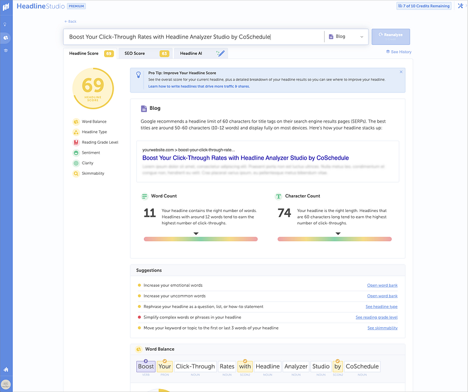

#### Why is this tool not talked about more?

There is a lot of content out in the world. Crafting compelling headlines is key to capturing your audience’s attention and driving engagement — but this is easier said than done. Content creators can fine-tune their headlines with tools like Headline Analyzer Studio by CoSchedule for maximum impact.I’ve been using CoSchedule and Headline Analyzer Studio for years, so not only am I an active user, but I also think it’s an incredibly undervalued tool for creators. I will walk through its pricing structure, the benefits of improving click-through rate (CTR) on content, and how to enhance SEO using this powerful tool.

### Best Features of Headline Analyzer Studio

One of the primary features of Headline Analyzer Studio is its Headline Strength Score. This score provides instant feedback on the effectiveness of your headline, considering factors like word choice, length, and emotional appeal.You also get insights into character and word counts, helping you optimize your headlines for search engines and social media platforms. By staying within optimal character and word limits, you can improve visibility and skimability. There are two sets of scores that operate independently, but are both important factors:

#### 1\. Headline Score

<figure>

<figcaption>

Headline Score Screenshot by the Author

</figcaption>

</figure>

This number ranges 0–100 and the goal is to make it to the 70+ mark. Once you submit the title idea, you’ll be able to see your score and suggestions for improving it. The headline score is made up of the following components:

- Word count & Character count: the ideal number for max engagement
- Word Balance: measures common, uncommon, emotional, and powerful words in your title
- Headline Type: list, how-to, question, or generic types help prep your audience for what to expect
- Reading Grade Level: how difficult it is to read/understand your headline
- Sentiment: the feeling or attitude of the tiele
- Clarity: how easy is it to understand with no other context
- Skimmability: how easy is your title to glance at and understand

#### 2\. SEO Score

<figure>

<figcaption>

SEO Score Screenshot by the Author

</figcaption>

</figure>

- Keyword quality: a combination of density, average searches, competition, and trending words in your headline
- Keyword density: how many people are searching for these specific terms (we’re looking for long-tail keywords here)
- Average monthly searches: how narrow is your audience
- Search Competition: how many headlines exist about this topic already
- Keyword trend: is this a fading trend, on the rise or an ongoing topic
- Headline Competition: how does your score stand up to the competition

### Pricing Setup

Headline Analyzer Studio offers free and paid plans (Basic and Premium). While the free plan provides essential headline analysis features, upgrading to a premium plan unlocks advanced functionalities like Headline AI, Competitor Analysis, Keyword suggestions, word banks and more.

<figure>

<figcaption>

Screenshot of pricing tiers by the author

</figcaption>

</figure>

They operate on a credit-based system, every month your credits are reset. Each time you analyze a headline, it uses one credit. The studio makes it very easy and clear which buttons will spend a credit. I spend anywhere from 1–3 credits per content piece, so I pay for 25 credits per month right now. The credits do not carry over each month, so I recommend starting with fewer credits and bumping up your subscription as needed.Unlimited credits start at $300 per year, so if you are a larger creator, or work with clients, this may be worth the investment over the long run.

### Why Pay for this tool?

#### Benefits of Improving CTR on Content

Improving the click-through rate of your content has huge benefits. It increases visibility by improving search engine rankings. Appearing in the top search results is crucial for driving traffic to your website, and this can be very hard to do on your own.Higher CTR leads to enhanced user engagement. Compelling headlines engage users to click, resulting in longer page visits and reduced bounce rates. Engaged users are more likely to consume your content and take the actions promoted on your content.Higher CTR often translates to higher _conversion_ rates. Whether your goal is to generate leads, drive sales, or increase subscriptions, a well-optimized headline can significantly impact sales.Ultimately, if no one is clicking, no one is visiting, no one is buying, and no one will find your stuff. Doing keyword research can be confusing and overwhelming, but Headline Analyzer makes it simple.

#### How to Improve SEO

Headline Analyzer Studio can be an essential tool for your SEO strategy. Start by optimizing headlines with relevant keywords to improve search engine visibility. The tool’s keyword analysis feature helps identify high-performing keywords for inclusion in your headlines.Experiment with different headlines using the tool’s Headline AI can help you analyze performance data to make data-driven decisions about your titles, captions & headlines.Additionally, pay attention to your meta descriptions. Craft short and clear meta descriptions using Headline Analyzer Studio insights to improve CTR. CoSchedule’s team has a library of incredible blog posts and free resources to improve your content as a whole. This headline tool is just the front door into your business, while it’s important to clean it up, the inside of the house is just as important.

* * *

Headline Analyzer Studio gives content creators valuable insights and tools to optimize their headlines for SEO, CTR, and better-sounding titles. Check [Headline Analyzer](https://coschedule.com/headline-analyzer) out for yourself and check out [CoSchedule](https://coschedule.com/r/o885678) as well.
