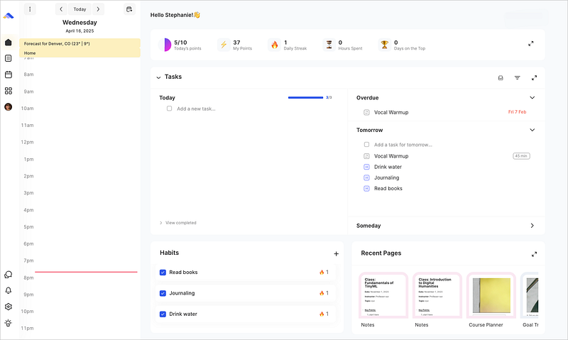

## ByDesign might be the perfect solution for overcomplicated apps

Let me start with a confession: I’m a productivity app junkie. I’ve tried them all — Notion, Sunsama, Trello, Asana, Flow, Timestripe, Twos, Akiflow, you name it. But every now and then, an app comes along that surprises me. [ByDesign](https://app.bydesign.io/) is one of those apps. It’s not just another task manager with note taker; it’s a visual, intuitive system that feels like a truly fuctional digital planner.

## Full Transparency

ByDesign reached out to me via email asking if I’d check out their app. Normally, I don’t say yes to these kinds of requests because I prefer to thoroughly test apps before recommending them. However, their website looked intriguing enough that I signed up for a free trial — and I’m genuinely impressed by what I found.

This isn’t a sponsored post, but I did sign up for their affiliate program because I believe in the product enough to share it with you. I have an affiliate code you can use to get 10% off:_“_NORACONRAD10”

<figure>

<figcaption>

ByDesign’s Streamlined Home Page

</figcaption>

</figure>

# The Problem: Too Many Tools, Not Enough Simplicity

If you’re like me, you’ve probably juggled multiple apps to manage your life. One for tasks, another for habits, and maybe a third for notes. It’s overwhelming. The worst part is that these tools often feel disjointed. Apple’s Reminders app doesn’t sync well with Notes, and habit trackers rarely integrate with project management systems. It’s like trying to build a puzzle with pieces from different boxes.

I’ve made huge, complex systems in apps like Notion and Coda. It’s literally my job. But for day to day personal habit tracking, I never kept up. The tools, promising flexibility and endless possibilities, were also huge distractions.

# ByDesign’s Streamlined Approach

ByDesign takes the disjointed management of habit/task/notes and turns it into simplicity. Here’s what makes it stand out:

- **Visual Project Tracking:** See your goals, habits, and projects laid out in one place. It’s perfect for implementing methodologies like the 12-week year or managing school projects.

- **Built-in Notes:** Unlike many task managers, ByDesign includes a reliable note system for long-term goals, journaling, or project details — something even apps like Accuflow and Sunsama don’t offer well.

- **Intuitive Design:** It’s not simple in terms of features or functionality, but in how it operates. Think of it as a digital planner with powerful capabilities.

- **Affordable Pricing:** At $4/month (yearly) or $6/month (monthly), it’s a steal compared to other productivity tools. They even offer a lifetime plan for $250 - great if you fall in love with it. This is a quarter of the cost of similar tools, with more features fully baked in.

# Who Is ByDesign For?

- **Students:** If you’re juggling classes, assignments, and personal goals, this could be your new best friend.

- **Content Creators & Small Business Owners:** It’s great for tracking content ideas and personal tasks, especially if you’re just starting out.

- **Beginners:** If Notion or Sunsama feels too complex, ByDesign’s intuitive layout is a breath of fresh air.

That said, if you’re managing a team or need robust project management features for a larger business, this might not be the tool for you. They are a great option for solorpreneurs, but I can’t recommend it for collabortive work just yet.

# A Real-World Test

I’m currently testing ByDesign for an upcoming product launch that involves multiple stages and components. I want to see how it handles the complexity of a long-term professional engagements, and I’m excited about the possibilities. Normally, I’d be knees deep in Notion templates, or spending an hour laying out the perfect project manager — but with ByDesign, it feels as natural as the notebook on my desk. It’s just easy to use.

# Why I’m Excited About ByDesign

What really won me over is how unique it feels in the crowded productivity app market. It’s not trying to be everything to everyone. Instead, it’s a focused, well-designed tool that bridges the gap between basic pre-installed phone apps and complex project management systems like ClickUp or Asana.

It’s the perfect middle ground — more functional than Apple’s suite of productivity apps but less overwhelming than Notion.

# Final Thoughts

If you’ve been searching for a way to organize your tasks, habits, and projects without the overwhelm, [ByDesign](https://app.bydesign.io/) might be the solution you’ve been waiting for. It’s simple without being simplistic, and it’s designed to help you focus on what matters most.

They offer a free trial, so you can test it risk-free. Who knows? It might just become your new favorite productivity tool.

_P.S. If you’re curious, you can use my affiliate code “_NORACONRAD10” _to get 10% off. Happy planning!_
