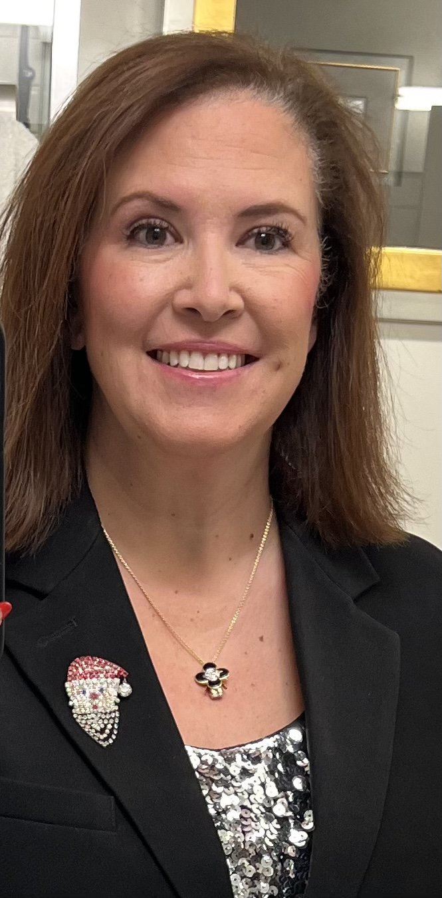

# _Hi, I’m Steph._

### _I Have A Knack For_ _Optimizing Systems_ _& A Love For Small Biz, I've Worn Many Hats From Startups To Established Brands. I'm Your Go-To For All Things_ _Data__._

# **_Me, in a snapshot_**

- ### Technical Skills
    
    HTML5, CSS3, Bootstrap, JavaScript, Typescript
    
    Currently learning: React.js, Node.js, Express.js, SQL & Database Management
    
- ### Software Experience
    
    Adobe Suite, Airtable, Amazon Vendor/Seller Central, Asana, Basecamp, Canva, CapCut, Clickup, Confido, ConvertKit, CoSchedule, Etsy, Final Cut Pro, Google Workspace, Gorgias, Honeybooks, Jira, Mailchimp, Mailerlite, Mem.ai, Microsoft Office, Miro, Notion, Obsidian, Quickbooks, Salesforce, Shopify, Supabase, Squarespace, Slack, Sellerboard, Shipstation, SPINs, SPS Commerce, Trello, Typeform, Vercel, Zapier and many more.
    
- ### Soft Skills
    
    Adaptability & Ability to Work Under Pressure: Quick to pivot in new situations, juggle multiple tasks, and switch tasks quickly
    
    Communication & Thick Skin: I believe in transparent and open communication, coupled with the ability to handle feedback with resilience and professionalism.
    
    Empathy & Customer Service: Builds strong and genuine relationships with excellent customer service skills
    
    Organized & Time Management: Very detailed, master of systems, with excellent organization and time management skills
    
    Problem-Solving: Expert at long-term solutions and simplified workflows
    
    Tech Savvy: Always expanding my knowledge with training and courses
    

## **_Sales Support Analyst_**

#### **_Ardor Energy  
Oct 2025 - Current_**

## **_Content Creator_**

#### **_Nora Conrad  
June 2012 - Ongoing_**

## **_Operations Manager_**

#### **_MacPac Fulfillment  
Aug 2012 - March 2023_**

## **_Owner & Founder_**

#### **_Sister Sprouts  
March 2023 - Dec 2023_**

- **Architected and deployed data infrastructure and analytics systems to support sales operations, retailer presentations, and production planning across an expanding distribution network (2,000 to 5,500+ stores).**
    
- **Managed weekly data integrations from four distributor sources (UNFI, KeHE, Whole Foods Supplier Portal, Amazon Seller Board) into proprietary Production Planner ERP, reducing manual reporting by ~2-3 hours weekly.**
    
- **Built dashboard MVP with retailer scorecards tracking cold placement percentages and merchandising ROI across 13 states and 11 SKUs.**
    
- **Conducted competitive intelligence analysis using SPINS and Nielsen data to inform positioning strategy against market re-entry by competitor.**
    

- **_Systems Strategist specializing in workflow optimization for moms, business owners, and students. Developed and curated five courses focused on automation and stress reduction, reaching thousands of women looking to boost their efficiency and productivity._**
    

- **_Crafted a specialized course for virtual assistants, emphasizing system organization and skill-building to elevate their professional capabilities._**
    
- **_Led a transformative course empowering women to automate and streamline daily tasks, freeing up time for family, personal hobbies, and entrepreneurial ventures._**
    
- **_Created and shared over 300 blog posts, 200 videos, and thousands of social media posts focused on productivity tools, tips, and systems._**
    
- **_Developed and managed hundreds of social media campaigns, developed automation and SOPs for best practices on social media accounts for both myself and my clients._**
    

- **_Organized and implemented a comprehensive shipment and wiki system using Notion, Asana, and Google Workspace. This enhanced order management, truck scheduling, and client dashboard development._**
    

- **_Maintained and managed the company website, marketing channels, and email list, ensuring a consistent online presence using tools such as Mailerlite, Squarespace, CoSchedule, Buffer, and WordPress._**
    
- **_Effectively managed client accounts, overseeing deadline-driven projects and shipments with project management systems._**
    
- **_Implemented inventory control programs to accurately label and account for all packages shipped to consumers from the warehouse._**
    
- **_Utilized various software and programs such as UPS Worldship, Shipstation, Shopify, Amazon Vendor Central, Amazon Seller Central, SPS Commerce, and Finale Inventory to process orders, issue POs, and send orders._**
    
- **_Managed order fulfillment and inventory on multiple retailer websites, including Amazon, Wayfair, SPS, Walmart, BigCommerce, VendorNet, and Shopify._**
    
- **_Organized day-to-day operations using a variety of software tools, including Zapier, Notion, Google Workspace, Microsoft Excel, Asana, RingCentral, Gorgias, Gmail, and ADP._**
    
- **_Created and managed project timelines for client onboarding and off-boarding, ensuring efficient project execution._**
    

- **_Solely designed and launched a fully operational Shopify store, implementing all aspects from product listings to payment gateways._**
    

- **_Streamlined fulfillment processes, optimizing shipping and inventory management for quick and efficient order fulfillment from POS, e-commerce, and social media channels including TikTok shop._**
    
- **_Grew customer base through targeted digital marketing strategies, achieving a profitable business model within the first 6 months._**
    
- **_Managed all customer service touchpoints, maintaining a high satisfaction rate and building a loyal customer community through social media campaigns, content marketing, and paid advertisements._**
    

## **_Operations Coordinator_**

#### **_Baronfig  
Aug 2016 - Current_**

- **_Collaborate to ensure seamless product launches, coordinate shipments, and manage logistics for e-commerce operations._**
    

- **_Utilize Amazon Vendor Central, Amazon Seller Central, Shopify, Shipstation, Settle, and other tools to optimize sales and inventory management._**
    
- **_Manage invoicing and PO generation with Amazon Vendor Central, Inventory Planner, and Finale Inventory Manager._**
    
- **_Coordinate, organize, and analyze sales data to plan and forecast sales in each quarter using tools like Salesforce, Inventory Planner, Shopify Analytics, Google Sheets, Excel, and more._**
    
- **_Managing calendars, projects, tasks and email organization systems to keep the staff productive and on schedule._**
    

Don’t just take my word for it

- 
    
    ## Dan Craytor
    
    Stephanie and I have worked together for nearly a decade. She is a dynamic thinker with an incredible ability to weave her skill set through a wide array of business projects. From day to day needs, to the wildly complex, Stephanie can navigate and add immense value no matter what the job at hand requires. She is a true "value add" and I cannot recommend her enough.
    
- 
    
    ## Melissa Whaley
    
    Stephanie was fun to work with and extremely talented. She was able to completely revamp my email organization system and help me with strategies to keep my inbox cleaned up on a regular basis. I highly recommend working with her to get your systems in order!
    
- 
    
    ## Kristi McAfee
    
    Stephanie worked for MacPac for over 10 years. She was an extremely valuable employee and asset to our team. Her organizational skills are over the top amazing. She is a person who is always trying to better her knowledge on new and upcoming techniques. Anyone who uses Stephanie will be very lucky as it will be only benefit your business greatly.
    
- 
    
    ## Mallika Malhotra
    
    I am so happy that I worked with Nora Conrad. She created how-to videos to teach me the process so that I can take care of things on my own. She was a wealth of information and a professional to work with.
    
- 
    
    ## Kaylee Johnson
    
    Stephanie helped me from day one. I was so lost when it came to setting up a blog as a business and she worked with me to sort it all out. Then she went a step further and taught me all sorts of systems and procedures to implement. It was like having my very own personal live course walk me through what I needed to do to expand my impact. I will be forever grateful to her!
    

## **_Education_**

- ### Salesforce Essential Certified
    
    This course covers key topics like managing existing customers, tracking and converting leads, managing a sales pipeline of potential sales, and using the built-in features of Salesforce for analyzing sales data and reporting.
    
    [See the certificate](https://www.linkedin.com/learning/certificates/daa2ea8f93b58d4dbc52f7f5089c54266d486911e95a0ec3948c47b0e6aea1e3)
    
- ### Content Marketing Certified
    
    Hubspot's Content Marketing certification tests for best practices and the capability of applying them to long-term content planning, content creation, promotion, and analysis, and increasing results through growth marketing.
    
    [See the certificate](https://app.hubspot.com/academy/achievements/vtm16pr0/en/1/stephanie-conrad/content-marketing)
    
- ### Shopify Essentials Certified
    
    LinkedIn Learning certifies Shopify Essentials by setting up an e-commerce website and providing a fully functioning customer experience on the platform using native tools and features including fulfillment, payment portals, shipping services and content management.
    
    [See the certificate](https://www.linkedin.com/learning/certificates/a1687125f0207992bf0a0f001ba9b39fc9b03dcad9c57aabe95b1abd415bac26?u=44171164)
    
- ### Notion Certifications
    
    Certified in Notion’s three core programs.
    
    [See my certifications.](https://www.credly.com/users/stephnoraconrad/badges)
    

With over a **decade** of hands-on experience, I've been in a variety of roles ranging from operations manager to data analyst. I thrive in fast-paced and startup environments. I've got a knack for streamlining tasks and decision-making, making life easier for everyone involved. I’ve mastered logistics, inventory control, and all the finicky sides of platforms like Amazon Vendor Central.

But I’m also about balance; I'm a mom, a wife, and a sister to my beautiful family, who inspire me to stay organized and productive every day. I bring that same dedication to the workplace, whether I’m managing calendars or optimizing systems. Passionate about productivity and tech, I'm your go-to for anything operations and data-based.

Feel free to reach out, whether it's for professional networking or just to swap productivity hacks. I’d love to work with you and meet new people 👋🏼
