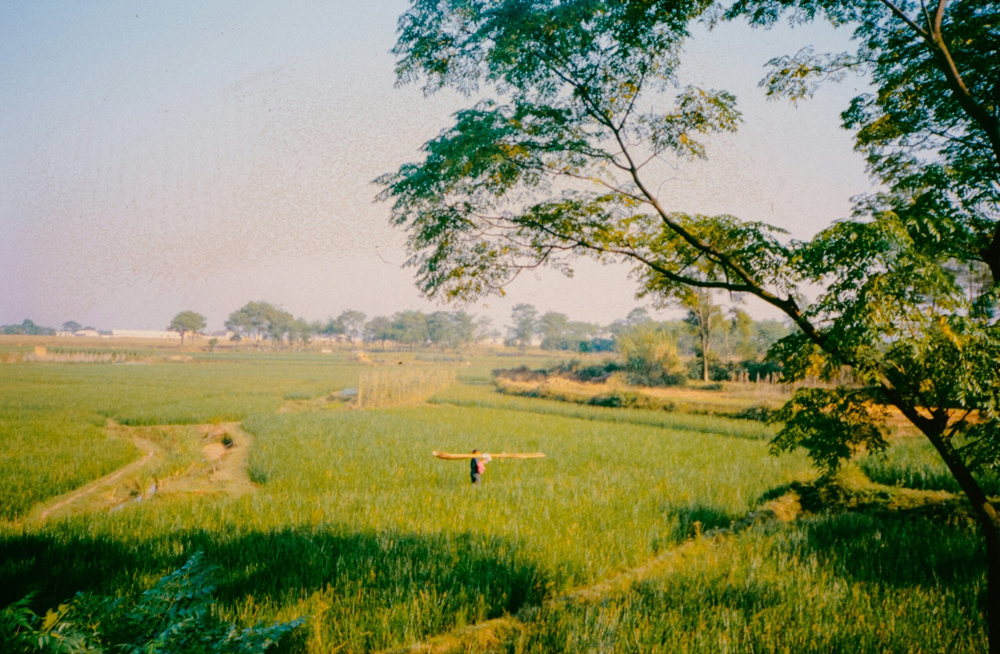

### 🦥 CONFESSIONS OF A PROCRASTINATOR

I can be incredibly lazy at times. What’s worse is that my laziness usually is paired with procrastination. I do not do well when I have deadlines — It’s a terrible flaw to have. I am running the Tough Mudder race in exactly 48 days and I am not prepared AT ALL.

I didn’t start running until about a week ago. I’ve been eating the same foods and the same portions as I have been the last year. And worst of all, my workouts consist of a few pushups and maybe some squats — every other day. As of today, I would not be physically able to complete a tough mudder, much less 13 miles. I have some work to do.

I have 48 days (40 days with rest days and the actual race day are taken out) to get in the best shape I’ve ever been in. Hence my challenge…

### 🗓 40 DAYS TO FIT

For 40 days I’m going to work my butt off and get in shape for this race. I have a hard time sticking to an exact workout routine. Every day varies how sore, tired, or energized I am, so my schedule is going to be very generalized so that I can allow myself room to get creative and try new things with my exercises.

For food and meals, my plan is to limit my diet to healthier options. I tend to eat well as long as I have healthy food in my fridge. I have created a list of things I will not purchase to help me limit my sugars. I also have some meal goals I want to try to work on.

I’ve decided to make graphics for each of these categories to help myself and others get motivated. This will also allow me to print them off and post them somewhere I will see them every day.

Here are some other run ideas you can use. These are the various workout we did while I was on the cross country team:

Mondays — Hills  
Tuesdays — Short Run  
Wednesdays — Long Run  
Thursdays — Intervals  
Fridays — Timed run  
Saturdays — Fun Day

Below are each of the days broken down into more detail.

**Hills:**  
Hills are the most painful and my personal favorite workout we did. Every Monday we went to this path that was a huge stretch of uphill. We started at the bottom and for 30 seconds we would run as hard and fast as we could up the hill. At the end of 30 seconds, you mark your spot and then cool off by jogging back down the hill. Once at the bottom you start again, try to make it to that same spot that you marked before. We would do 5–10 of these. I loved doing this workout because you can see your progress each time you run up the hill, and after I few weeks you can see how much farther you get up the hill. It’s a great way to help your endurance and to see instant progress.

**Short-run:**  
Depending on where you are at physically a short run can mean 1 mile or 4 miles. A short run means we ran 10 minutes away from our school, and then turned around and came back. A short run doesn’t mean an easy run. For 20 minutes you run as hard and fast as you can at a consistent pace.

**Long Run:**  
A long run meant that we would run between 5 and 10 miles. We switched up the distance each week and got farther and farther as the season went on. The goal of these long runs was to try to keep a consistent pace. I usually tried to run a 9 min mile, toward the end of the season I was running at a 7.25 min mile pace.

**Intervals:**  
We ran these on the track. This was all about timing and trying to beat your previous times. I’ll tell you all the times we had to run and you can adjust them to fit your pace. Keep in mind, this isn’t supposed to be easy, these should hurt. We ran one mile for 9 minutes, then walked one lap, then we stretch as a warm-up.  
400 meters (1 lap) @ 60 seconds  
100m @ 60s  
800m @ 150s  
100m @ 60s  
400m @ 50s  
100m @ 60s  
800m @ 120s  
100m @ 60s  
400m @ 45s  
100m @ 60s  
400m @ 40s

This totals to 4.5 miles in approx. 25 min. (Including the warm-up)

**Timed run:**  
Fridays we would decide on a time, usually between 20 and 45 minutes, and run for that time at a slow pace. A slow pace means around 9–12 minute miles depending on your fitness level.

**Fun-Day:**  
For our fun days, we would choose each week what to do. As a team, we could run to a nearby park and play flag football or ultimate frisbee. Or if you’re running as an individual you can go for a swim, run in a new area, ride a bike, or do anything that keeps your heart rate up. We would play, run, swim or bike for a total of 1 hour then head home.

Keep in mind, I’m not an expert in any way when it comes to diet. These are general guidelines I’m using to eat a little healthier and still hit all the vitamins and calories I need.

In the past, I’ve also tried intermittent fasting with some really good results — find a schedule that fits you best and focus on eating good foods. Fresh fruits and veggies, complex carbs, and lean proteins are my goals.

### 🏆 ARE YOU UP FOR THE CHALLENGE?

This race is going to happen whether I’m ready or not. I have 3 other people who are counting on me to be in shape and be able to be a part of a team. I do not want to be the weak link, and hopefully, at the end of the race, I’ll be proud of what I’ve accomplished.

Whether you’re in training or just want to get in shape, I hope you will follow this challenge with me. I’d love to do this along with others to help each other stay motivated throughout the next few weeks.

**_Good luck!_**

* * *

👏🏼 If you found this article valuable hit those clapping hands once or twice.

💻 If you want to support my work and thousands of others, consider [signing up for Medium](https://blog.noraconrad.com/subscribe). (If you sign up [using my link](https://blog.noraconrad.com/subscribe), I earn a small commission.)

✨ Thank you for reading & for your support!
