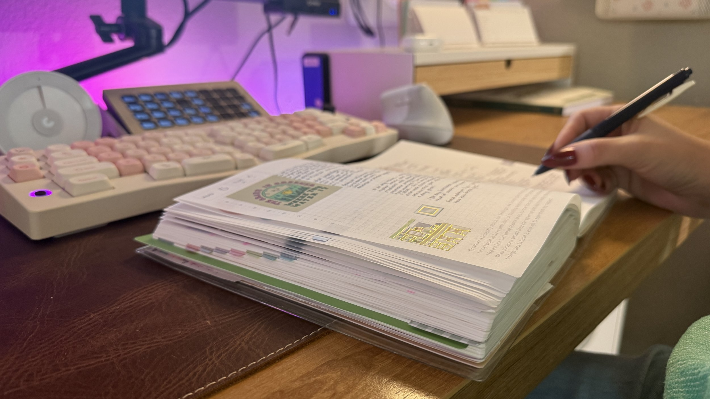
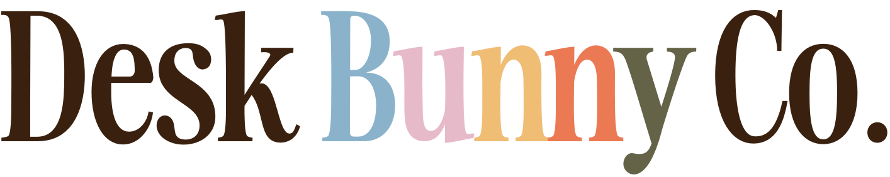
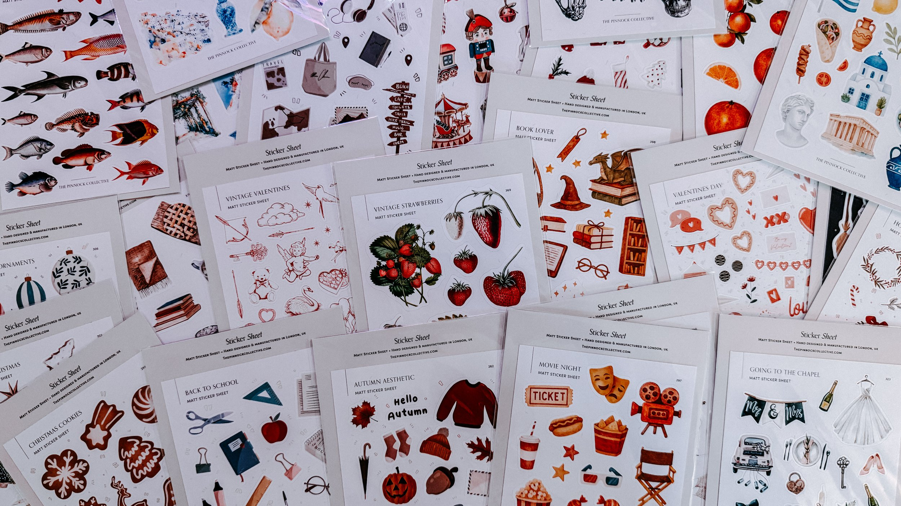
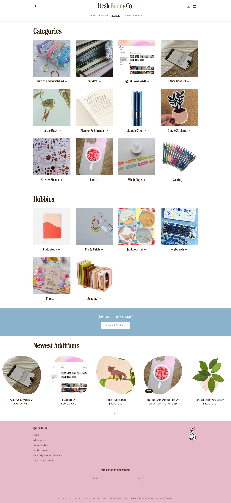

I decided I wanted to open up an e-commerce shop, but this isn’t my first rodeo. Back in 2023, I ran a shop called Sister Sprouts, where I sold houseplants online. I loved it: the thrill of selling something I cared about, setting up at farmers markets, talking about products I was passionate about… but plants are demanding inventory. I was constantly fighting pests, losing stock during shipping, dealing with soil quality issues from different suppliers, and paying a hefty insurance premium just so I could afford to replace plants if something went wrong.

By 2024, I closed it down. But even as I wrapped up, I knew I wanted to run another shop someday, just not with houseplants.

Fast forward to August 2025. After a year of mulling it over, I decided to step back into ecommerce. This time, I chose something that feels closer to home: [**stationery**](https://deskbunny.co/).

### Why Stationery?

Aside from plants, my other big passion is planning and stationery. My childhood was filled with playing “teacher” and “office” just so I could use up paper and sticky notes. I love journaling, doodling, and filling pages with stickers and scraps. On top of that, I work as an operations manager for a luxury pen company, which gave me a behind-the-scenes look at the industry.

That’s where I noticed the gap. One of my favorite online shops is JetPens, especially their sampler bundles. They’ll sell you, say, a set of all-brown pens from different brands and sizes, so you can test what you like before committing to a full pack. But outside of pens, this doesn’t really exist.

Field Notes always come in three-packs. Sticker sheets are sold in full sets. Small artists require order minimums that, once you add shipping, get expensive fast. Sometimes I just want to test the quality of one notebook or try two stickers from a sheet. That’s the hole I wanted Desk Bunny Co. to fill: a stationery and gift shop where people can test individual products before committing to bundles or full packs.

My vision is this:

**Offer testers and full-size versions side by side** (e.g., one single pen _and_ the 20-pack). AND **Create my own products and partner with small artists** to showcase their stickers, pins, or prints alongside bigger brands.

I want Desk Bunny to be a shop that sparks creativity, whether you’re a journaling nerd like me or a work-from-home person just trying to make your desk feel cozy and inspiring.

If Sister Sprouts taught me anything, though, it’s that your niche will find you, not the other way around. So instead of wasting more time strategizing, I jumped in with both feet.

### The Name

I landed on [**Desk Bunny Co.**](https://deskbunny.co/) because it reminded me of “ski bunny” — someone who’s just always at their desk, passionate about their setup. It also nods to a cuter, cozy aesthetic, which fits the stationery vibe I want to build.

### Setting Up the Business

Here’s where it gets less romantic and more paperwork.

I already had **Nora Network LLC**, which I run my blog and content business through. So instead of starting from scratch, I filed **Desk Bunny Co. as a DBA (Doing Business As)** under that LLC. That saved me a few hundred dollars.

- **DBA filing (CO):** $20
    
- **Sales Tax Registration (CO):** $55.98
    
- **Domain name (Namecheap):** $12.48 (deskbunny.co — the .com is thousands, so I’ll wait)
    
- **Shopify:** $2 so far, thanks to their $1/month for 6 months deal. (After that, it jumps to $39/mo.)
    

Instead of using something expensive like QuickBooks, I’m using **Coda** to track expenses, inventory, and systems. It’s simple, flexible, and cheap. Here’s where my money has gone so far:

- **Overhead:** $92.44
    
- **Inventory:** $260.68
    
- **Samples (Printful, Sticker Mule, Dropshipman):** $81.07
    

#### → Total: **$434.19**

_Not nothing, but also way less than the thousands people often assume it takes to start._

### Inventory: A $300 Challenge

I gave myself a budget of $300 to get products into the store. The first orders were deliberate:

- Sticker sheets from a brand I’d tested before and loved
    
- Notebooks sold only in three-packs that I knew I could break apart and sell individually (tripling my inventory count while testing the sampler concept)
    

That covered the basics, but I also wanted variety in the catalog. So I spent some money on:

- **Print on demand products from Printful** with my own logo and doodles (expensive compared to bulk production, but useful to test designs before committing)
    
- **Sticker Mule and Death by Sticker** to get samples for eventual bulk orders of sticker sheets.
    
- **Dropshipman samples** to test quality before offering them online
    

### Wrestling with Dropshipping

I tested the usual dropshipping apps that connect with Shopify. The quality was inconsistent, and shipping times were too long and I didn’t want to fill my shop with low-grade products just for the sake of it.

That’s when I found **Shopify Collective**, which lets stores cross-list each other’s products. Profit margins are awful (2–10%), but it helped in two ways:

1. Populating the store with more products so it feels more lived-in
    
2. Market research: if something sold through Collective, I could source it wholesale from Faire later for better margins
    

It’s not a long-term profit model, but as a research and filler tool, it works for now. Plus I get a small profit in return for the advertising and I get to test what products my audience like best.

### What’s Working (and What Isn’t)

**Working:**

- Leveraging Nora Network LLC instead of starting a brand-new company
    
- Keeping upfront costs low with Shopify’s promo and Coda instead of big software
    
- Testing the sampler concept with suppliers I already trusted
    
- Using Collective for catalog + data gathering
    

**Not working (yet):**

- Breaking up bundles takes time and can cause fulfillment headaches
    
- Thin margins make it hard to scale quickly
    
- Dropshipping and POD as a fulfillment method isn’t sustainable for quality
    

### What’s Next

The shop is scrappy and experimental right now. The plan is to:

- Identify which tester products resonate most and stock those in bulk
    
- Build partnerships with small artists
    
- Automate fulfillment before orders pile up
    
- Focus marketing on the niche that actually cares about testers
    
- Set up a social media plan and begin posting. Can’t sell if nobody knows I exist 🙃
    

### Why I’m Sharing This

This isn’t the glossy “I launched and made $10k in 30 days” narrative. This is the real version: filing state paperwork, spending money slowly and carefully, breaking up three-packs into singles, testing sticker printers, and learning which suppliers to trust and so on.

Desk Bunny Co. is going to be built slowly, by testing ideas, and being transparent about the highs, lows, and lessons along the way. The big dream is private for now, but I hope that this journey will inspire you to kick off the plan you’ve been mulling over.

So that’s where I’m at. The store is live, the products are trickling in, and I’ll keep sharing the wins, the missteps, and everything in between.

#### If you want to peek at the shop or be one of our first customers — use the code “[omgIknowher](https://deskbunny.co/discount/omgIknowher)” for 10% off 🫶🏼  

