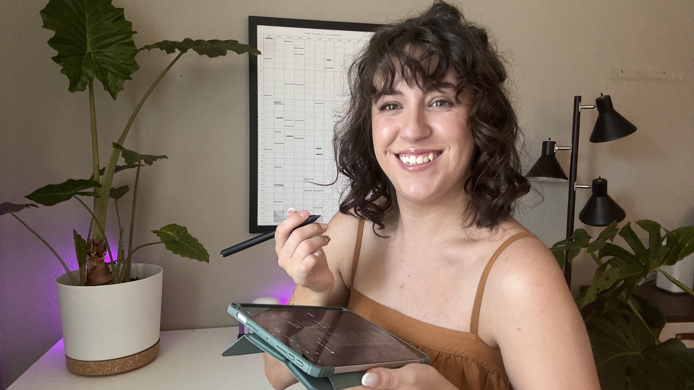

# **Reach work-from-home entrepreneurs who are ready to make a purchase**

 

## We look good together 😏

Your productivity tools and business solutions need customers who understand the challenge of building something meaningful while managing a household. I connect you directly with small business owners who are actively seeking solutions and convert from content to trial sign-ups.

Work-from-home entrepreneurs with families don't have time for tools that don't deliver. They research thoroughly, invest strategically, and become loyal customers when something genuinely improves their productivity. My subscribers and monthly visitors represent this exact demographic: small business owners balancing growth with family responsibilities.

**You get:**

- High-converting content (9.6% click-to-signup rate across affiliates)
    
- UGC assets you can repurpose in paid campaigns
    
- Access to decision-makers with budgets and buying intent
    
- Content that naturally integrates with proven productivity workflows
    

### Previously partnered with…

class="Marquee-item Marquee-item--text"

style="margin-right: 0.5em; font-size: 4rem;" > Stellar Panel

class="Marquee-item Marquee-item--text"

style="margin-right: 0.5em; font-size: 4rem;" > •

class="Marquee-item Marquee-item--text"

style="margin-right: 0.5em; font-size: 4rem;" > Clever Fox

class="Marquee-item Marquee-item--text"

style="margin-right: 0.5em; font-size: 4rem;" > •

class="Marquee-item Marquee-item--text"

style="margin-right: 0.5em; font-size: 4rem;" > Scrintal

class="Marquee-item Marquee-item--text"

style="margin-right: 0.5em; font-size: 4rem;" > •

class="Marquee-item Marquee-item--text"

style="margin-right: 0.5em; font-size: 4rem;" > Skylight Calendar

class="Marquee-item Marquee-item--text"

style="margin-right: 0.5em; font-size: 4rem;" > •

class="Marquee-item Marquee-item--text"

style="margin-right: 0.5em; font-size: 4rem;" > Notion

class="Marquee-item Marquee-item--text"

style="margin-right: 0.5em; font-size: 4rem;" > •

# class="Marquee-item Marquee-item--text"

style="margin-right: 0.5em; font-size: 4rem;" > Prose

# class="Marquee-item Marquee-item--text"

style="margin-right: 0.5em; font-size: 4rem;" > •

# class="Marquee-item Marquee-item--text"

style="margin-right: 0.5em; font-size: 4rem;" > Olipop

# class="Marquee-item Marquee-item--text"

style="margin-right: 0.5em; font-size: 4rem;" > •

# class="Marquee-item Marquee-item--text"

style="margin-right: 0.5em; font-size: 4rem;" > Tella

# class="Marquee-item Marquee-item--text"

style="margin-right: 0.5em; font-size: 4rem;" > •

# class="Marquee-item Marquee-item--text"

style="margin-right: 0.5em; font-size: 4rem;" > Sunsama

# class="Marquee-item Marquee-item--text"

style="margin-right: 0.5em; font-size: 4rem;" > •

# class="Marquee-item Marquee-item--text"

style="margin-right: 0.5em; font-size: 4rem;" > Icons8

# class="Marquee-item Marquee-item--text"

style="margin-right: 0.5em; font-size: 4rem;" > •

# Stellar Panel • Clever Fox • Scrintal • Skylight Calendar • Notion • Prose • Olipop • Tella • Sunsama • Icons8 • Stellar Panel • Clever Fox • Scrintal • Skylight Calendar • Notion • Prose • Olipop • Tella • Sunsama • Icons8 •

 

- ## Niche & Topics
    
    I cater to working moms and stay-at-home parents who are looking to get productive and find balance in their lives. My focus is on purposeful productivity practices including mental health, work-life balance, and system building.
    
- ## Audience Breakdown
    
    82% Female
    
    65% United States  
    5% United Kingdom  
    5% Canada
    
    9.9k Page views per month  
    9.5k Unique users per month  
    900+ Medium followers
    
- ## Social Audience
    
    **YouTube**  
    4.5k monthly views  
    8k subscribers
    
    **TikTok**  
    2k followers  
    31k Monthly Views
    
    **Pinterest**  
    62.2k monthly impressions  
    6.5k followers
    
    **Email**  
    2.6k email subscribers  
    33.99% average open rate  
    6.42% average click rate
    

 

# Bundles

_The base plan is set at $750 and includes a comprehensive blog post (1,500+ words), an accompanying YouTube video walkthrough with SEO optimization as well as 30-day standard usage rights (your owned channels only)._

* * *

#### Standard Package - $950

Get the complete content creation experience plus extended usage rights to maximize your organic reach. This package gives you everything you need to feature your brand across your website, social channels, and internal team materials for a full year.

Perfect for companies who want quality content that keeps working long after publication, without the complexity of campaign management.

**Includes:**

- Base content creation plan
    
- Basic usage rights (12 months)
    
- Email newsletter promotion
    
- One social post (TikTok)
    

* * *

* * *

#### Professional Package - $1,450

The complete marketing powerhouse package. Beyond the core content creation, you get full marketing flexibility to drive real business results. Use the content in your email sequences, sales funnels, paid advertising campaigns, and customer onboarding flows. This is ideal for companies ready to scale their marketing efforts and want content that seamlessly integrates across their entire marketing ecosystem.

**Includes:**

- Base content creation plan
    
- Marketing usage rights (24 months)
    
- Email newsletter promotion
    
- One social post per channel (TikTok, Pinterest and LinkedIn)
    

* * *

* * *

#### Premium Package - $2,100

Ultimate content ownership and flexibility. Everything in Professional plus perpetual usage rights, white-labeling capabilities, and unlimited editing freedom. Perfect for companies building courses, training programs, or long-term educational content. Create derivative materials, case studies, and adapt the content however your business evolves. This is content that becomes a permanent asset in your marketing arsenal.

**Includes:**

- Base content creation plan
    
- Full commercial rights (perpetual)
    
- Email newsletter promotion
    
- One social post per channel (TikTok, Pinterest and LinkedIn)
    

* * *

 

## Extended Usage Rights

Need broader content usage for marketing campaigns, sales materials, or training? Add extended usage rights to maximize your content investment.

### $300

#### Basic Usage

- Website and blog usage
    
- Social media profiles (organic posts)
    
- Internal team training materials
    
- Email newsletter inclusion
    
    **Duration:** 12 months
    

### $800

#### Marketing Rights

- Everything in Basic Usage +
    
- Email marketing campaigns
    
- Sales and landing pages
    
- Customer onboarding sequences
    
- Social media advertising
    
- Marketing automation workflows
    
    **Duration:** 24 months
    

### $1500

#### Full Commercial

- Everything in Marketing Usage +
    
- White-label usage in courses/programs
    
- Derivative content creation rights
    
- Case study development
    
- Unlimited editing and adaptation
    
    **Duration:** Perpetual
    

#### Dedicated Video - $450

A video 4-8 minutes in length completely about your company or product. Whether it be a review, comparison, tutorial or something creative, this is a great way to get media focused 100% on your company. Includes thumbnail design and SEO optimization.

#### Integrated Video - $185

Integrate your company or product into a planned video. You can include a 30-60 second dedicated segment, or let me naturally weave your product into the content where it fits organically. Perfect for software tools and productivity solutions.

#### 30-second Ad Read -$125

A dedicated 30-second sponsorship segment within any video. Includes your key messaging, call-to-action, and any special offers. Great for building brand awareness with my engaged audience of 5,700+ average views per video.

#### Dedicated Blog Post - $275

A comprehensive blog post (800-1,500 words) entirely focused on your product or service. Includes SEO optimization, social media snippets, and email newsletter feature. Published on my blog and promoted across all channels.

# A La Carte

_All pricing includes standard 30-day usage rights. Extended usage rights available as add-ons._

#### Integrated Blog Post - $150

Seamlessly integrate your product into an existing blog post topic. Your tool gets featured as a solution within broader productivity or business systems content. Includes 200-400 words of dedicated coverage within the larger piece.

#### 200-word Ad Space - $85

Dedicated advertising space within my email newsletter or blog sidebar. Include your messaging, visuals, and call-to-action. Reaches 1,000+ engaged subscribers with 49% average open rates and 5% click-through rates.

## _Ready to work together?  
Fill out the form to get started._
